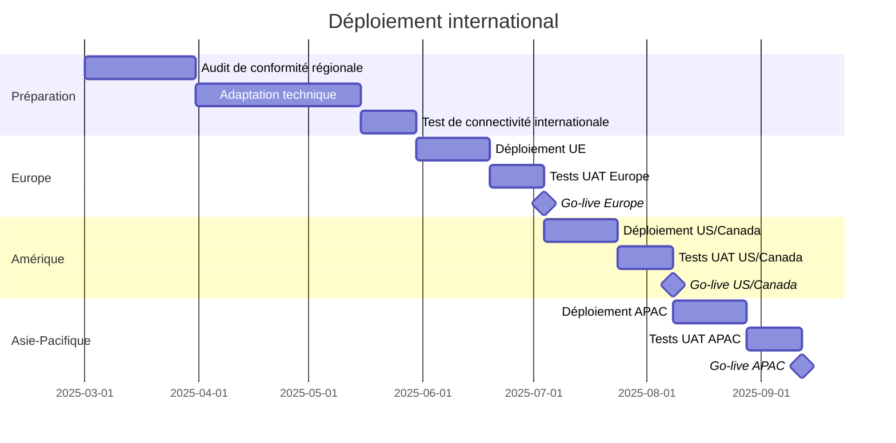

# Guide de déploiement sécurisé pour etika-payment-integration

## 1. Introduction

Ce document fournit les instructions détaillées pour déployer le module `etika-payment-integration` en environnement de production, en respectant les normes de sécurité PCI-DSS. Il s'adresse aux équipes d'infrastructure, de sécurité et de DevOps d'Étika.

## 2. Prérequis de sécurité

### 2.1 Certifications et conformité

Avant tout déploiement en production, les éléments suivants doivent être en place :

- **Certification PCI-DSS niveau 1** pour l'environnement d'hébergement
- **Audit de sécurité** complet du code et de l'infrastructure
- **Évaluation des risques** documentée et validée
- **Plan de réponse aux incidents** spécifique aux systèmes de paiement

### 2.2 Infrastructure requise

- **Environnement isolé** (compte cloud dédié ou réseau physique séparé)
- **HSM (Hardware Security Module)** certifié FIPS 140-2 niveau 3 ou plus
- **Pare-feu WAF** dédié avec règles spécifiques pour les applications de paiement
- **Système de détection d'intrusion (IDS)** avec alertes en temps réel
- **Système de surveillance et de logging** centralisé

### 2.3 Compétences requises

- Expertise en sécurité des systèmes de paiement
- Connaissance approfondie des règles PCI-DSS
- Maîtrise des HSM et de la gestion des clés cryptographiques
- Expérience en déploiement d'applications à haute disponibilité

## 3. Architecture de déploiement sécurisé

### 3.1 Segmentation réseau


- **Zone démilitarisée (DMZ)** : Héberge uniquement les composants d'API Gateway
- **Zone d'application** : Héberge les services métier principaux
- **Zone de données** : Héberge les bases de données et le stockage
- **Zone HSM** : Accès exclusif pour les opérations cryptographiques

Le trafic entre zones doit être strictement contrôlé par des pare-feu dédiés avec inspection approfondie des paquets.

### 3.2 Architecture multi-régions

Pour assurer une haute disponibilité et une résilience optimale, le déploiement devrait être effectué dans au moins deux régions géographiques distinctes :

- **Région primaire** : Centre de traitement principal
- **Région secondaire** : Reprise d'activité et balancement de charge
- **Synchronisation** : Réplication asynchrone des données non-sensibles uniquement

### 3.3 Diagramme de déploiement

```
┌────────────────────────────────────────────────────────────────┐
│                  Région Primaire                               │
│                                                                │
│  ┌─────────┐     ┌─────────┐      ┌─────────┐     ┌─────────┐  │
│  │   WAF   │────▶│  API    │─────▶│ Services│────▶│  Data   │  │
│  │         │     │ Gateway │      │         │     │ Storage │  │
│  └─────────┘     └─────────┘      └─────────┘     └─────────┘  │
│        │               │               │               │       │
│        └───────────────┴───────────────┴───────────────┘       │
│                               │                                 │
│                               │                                 │
│                        ┌──────▼──────┐                          │
│                        │    HSM      │                          │
│                        └─────────────┘                          │
└────────────────────────────────────────────────────────────────┘
                               │                                    
                               │  Réseau privé sécurisé             
                               ▼                                    
┌────────────────────────────────────────────────────────────────┐
│                  Région Secondaire                             │
│                                                                │
│  ┌─────────┐     ┌─────────┐      ┌─────────┐     ┌─────────┐  │
│  │   WAF   │────▶│  API    │─────▶│ Services│────▶│  Data   │  │
│  │         │     │ Gateway │      │         │     │ Storage │  │
│  └─────────┘     └─────────┘      └─────────┘     └─────────┘  │
│        │               │               │               │       │
│        └───────────────┴───────────────┴───────────────┘       │
│                               │                                 │
│                               │                                 │
│                        ┌──────▼──────┐                          │
│                        │    HSM      │                          │
│                        └─────────────┘                          │
└────────────────────────────────────────────────────────────────┘
```

## 4. Gestion des secrets et des clés

### 4.1 Système HSM

Le module `etika-payment-integration` doit utiliser un HSM pour toutes les opérations cryptographiques sensibles :

1. **Types de HSM supportés** :
   - AWS CloudHSM
   - Azure Key Vault HSM
   - Thales Luna Network HSM
   - Utimaco SecurityServer

2. **Configuration minimale du HSM** :
   - Certification FIPS 140-2 niveau 3 ou plus
   - Support pour les algorithmes post-quantiques
   - Capacité de rotation automatique des clés
   - Journalisation et audit complets

### 4.2 Hiérarchie des clés

Respecter la hiérarchie de clés suivante :

1. **Clés maîtres** (KEK - Key Encryption Keys) :
   - Stockées exclusivement dans le HSM
   - Rotation annuelle
   - Quorum d'administrateurs requis pour les opérations sur ces clés

2. **Clés de chiffrement des données** (DEK - Data Encryption Keys) :
   - Rotation trimestrielle
   - Stockées sous forme chiffrée par une KEK
   - Génération et utilisation via le HSM uniquement

3. **Clés de signature** :
   - Rotation semestrielle
   - Stockées exclusivement dans le HSM
   - Utilisation d'algorithmes post-quantiques si disponibles

### 4.3 Configuration du gestionnaire de clés

```yaml
key_rotation:
  encryption_keys:
    active_period_days: 90
    retirement_period_days: 180
    algorithm: "Kyber"
    auto_rotation: true
    
  signing_keys:
    active_period_days: 180
    retirement_period_days: 365
    algorithm: "Dilithium"
    auto_rotation: true
    
  token_protection_keys:
    active_period_days: 60
    retirement_period_days: 120
    algorithm: "Kyber"
    auto_rotation: true

hsm:
  type: "AwsCloudHsm"
  endpoint: "hsm.example.com"
  partition: "etika-payments"
  max_sessions: 20
  timeout_seconds: 30
  auth_method:
    type: "Certificate"
    cert_path: "/etc/etika/certs/hsm-client.crt"
    key_path: "/etc/etika/certs/hsm-client.key"
```

## 5. Durcissement des serveurs et de l'infrastructure

### 5.1 Configuration des serveurs

Tous les serveurs hébergeant des composants de `etika-payment-integration` doivent être durcis selon les recommandations suivantes :

1. **Système d'exploitation** :
   - Distribution Linux LTS minimale (Ubuntu Server 22.04 LTS recommandé)
   - Mise à jour automatique des correctifs de sécurité
   - Désactivation de tous les services non essentiels
   - Mode noyau SELinux ou AppArmor en mode enforcing

2. **Conteneurisation** :
   - Utilisation de conteneurs distroless ou minimaux
   - Exécution sans privilèges
   - Scan automatique des vulnérabilités des images
   - Politique d'admission stricte pour Kubernetes

3. **Configuration réseau** :
   - Pare-feu en liste blanche uniquement
   - Filtrage des connexions par IP source/destination
   - Désactivation de tous les ports non utilisés
   - Protocole TLS 1.3 uniquement avec cipher suites renforcées

### 5.2 Configuration de la base de données

1. **Sécurisation** :
   - Chiffrement des données au repos (TDE)
   - Chiffrement des connexions (TLS)
   - Authentification forte (certificats clients)
   - IAM avec principe du moindre privilège

2. **Isolation** :
   - Déploiement dans un sous-réseau privé
   - Accès uniquement depuis les services autorisés
   - Désactivation de l'accès direct depuis l'Internet
   - Utilisation de points de terminaison VPC/VNET

### 5.3 Exemple de configuration du pare-feu

```
# Règles iptables pour serveur d'application etika-payment-integration

# Par défaut, bloquer tout trafic
iptables -P INPUT DROP
iptables -P FORWARD DROP
iptables -P OUTPUT DROP

# Autoriser loopback
iptables -A INPUT -i lo -j ACCEPT
iptables -A OUTPUT -o lo -j ACCEPT

# Autoriser les connexions établies
iptables -A INPUT -m state --state ESTABLISHED,RELATED -j ACCEPT
iptables -A OUTPUT -m state --state ESTABLISHED,RELATED -j ACCEPT

# SSH (restreint aux IP de gestion)
iptables -A INPUT -p tcp -s 10.0.0.0/24 --dport 22 -m state --state NEW -j ACCEPT

# API du service (depuis l'API Gateway uniquement)
iptables -A INPUT -p tcp -s 10.1.0.0/24 --dport 8443 -m state --state NEW -j ACCEPT

# Connexion HSM
iptables -A OUTPUT -p tcp -d 10.2.0.0/24 --dport 2223 -m state --state NEW -j ACCEPT

# DNS
iptables -A OUTPUT -p udp --dport 53 -m state --state NEW -j ACCEPT

# NTP
iptables -A OUTPUT -p udp --dport 123 -m state --state NEW -j ACCEPT

# Métriques et monitoring
iptables -A OUTPUT -p tcp -d 10.3.0.0/24 --dport 2003 -m state --state NEW -j ACCEPT
```

## 6. Déploiement et configuration

### 6.1 Processus de déploiement sécurisé

1. **Préparation des images** :
   - Build dans un pipeline CI/CD sécurisé
   - Signature des images avec Notary/Cosign
   - Scan complet des vulnérabilités (Trivy, Grype)
   - Vérification de la provenance avec chaîne SLSA niveau 3+

2. **Méthode de déploiement** :
   - Utilisation de GitOps avec Flux ou ArgoCD
   - Déploiement Blue/Green pour éviter les interruptions
   - Canary testing avant déploiement complet
   - Rollback automatique en cas d'échec

3. **Configuration des secrets** :
   - Utilisation de Vault ou AWS/GCP/Azure Secret Manager
   - Injection des secrets via CSI driver
   - Rotation automatique des credentials
   - Audit complet des accès aux secrets

### 6.2 Exemple de manifest Kubernetes

```yaml
apiVersion: apps/v1
kind: Deployment
metadata:
  name: etika-payment-integration
  namespace: payments-prod
  labels:
    app: etika-payment-integration
    component: payment-processor
spec:
  replicas: 3
  selector:
    matchLabels:
      app: etika-payment-integration
  strategy:
    type: RollingUpdate
    rollingUpdate:
      maxSurge: 1
      maxUnavailable: 0
  template:
    metadata:
      annotations:
        seccomp.security.alpha.kubernetes.io/pod: runtime/default
        vault.hashicorp.com/agent-inject: "true"
        vault.hashicorp.com/agent-inject-secret-hsm-credentials: "secrets/data/payment/hsm"
        vault.hashicorp.com/role: "payment-integration"
      labels:
        app: etika-payment-integration
    spec:
      serviceAccountName: payment-integration-sa
      securityContext:
        runAsUser: 1000
        runAsGroup: 1000
        fsGroup: 1000
      containers:
      - name: payment-integration
        image: etika/payment-integration:1.0.0@sha256:abc123...
        imagePullPolicy: Always
        securityContext:
          allowPrivilegeEscalation: false
          readOnlyRootFilesystem: true
          capabilities:
            drop: ["ALL"]
        ports:
        - containerPort: 8443
          name: https
        resources:
          limits:
            cpu: "2"
            memory: "4Gi"
          requests:
            cpu: "1"
            memory: "2Gi"
        livenessProbe:
          httpGet:
            path: /health
            port: 8443
            scheme: HTTPS
          initialDelaySeconds: 30
          periodSeconds: 10
        readinessProbe:
          httpGet:
            path: /ready
            port: 8443
            scheme: HTTPS
          initialDelaySeconds: 5
          periodSeconds: 5
        volumeMounts:
        - name: tmp
          mountPath: /tmp
        - name: certs
          mountPath: /etc/etika/certs
          readOnly: true
        env:
        - name: CONFIG_FILE
          value: "/etc/etika/config/production.yaml"
        - name: LOG_LEVEL
          value: "INFO"
        - name: METRICS_ENABLED
          value: "true"
      volumes:
      - name: tmp
        emptyDir: {}
      - name: certs
        secret:
          secretName: etika-payment-certs
      - name: config
        configMap:
          name: etika-payment-config
      affinity:
        podAntiAffinity:
          requiredDuringSchedulingIgnoredDuringExecution:
          - labelSelector:
              matchExpressions:
              - key: app
                operator: In
                values:
                - etika-payment-integration
            topologyKey: "kubernetes.io/hostname"
```

## 7. Configuration du monitoring et de la journalisation

### 7.1 Logging

Toutes les activités du système doivent être journalisées de manière sécurisée pour assurer l'auditabilité :

1. **Format de logs** :
   - Format JSON structuré
   - Inclusion des ID de corrélation
   - Timestamps en UTC et ISO 8601
   - Niveau de détail configurable (INFO en prod, DEBUG en dev)

2. **Champs obligatoires** :
   - `timestamp`: Horodatage de l'événement
   - `correlation_id`: Identifiant unique de la transaction
   - `service`: Nom du service émetteur
   - `level`: Niveau de log (INFO, WARN, ERROR, etc.)
   - `message`: Description de l'événement
   - `user_id`: Identifiant de l'utilisateur (si applicable)
   - `source_ip`: Adresse IP source (anonymisée si nécessaire)

3. **Traitement des logs** :
   - Agrégation centralisée (via Fluent Bit/Fluentd)
   - Stockage immuable pendant 2 ans minimum
   - Indexation et recherche (ELK, Loki)
   - Alertes automatiques sur patterns suspects

### 7.2 Configuration de log4j2.xml

```xml
<?xml version="1.0" encoding="UTF-8"?>
<Configuration status="WARN" monitorInterval="30">
    <Properties>
        <Property name="LOG_PATTERN">
            %d{yyyy-MM-dd'T'HH:mm:ss.SSSZ} %p %m%n
        </Property>
        <Property name="APP_LOG_ROOT">/var/log/etika</Property>
    </Properties>
    <Appenders>
        <Console name="Console" target="SYSTEM_OUT" follow="true">
            <JsonLayout compact="true" eventEol="true">
                <KeyValuePair key="service" value="etika-payment-integration"/>
                <KeyValuePair key="hostname" value="${env:HOSTNAME}"/>
                <KeyValuePair key="environment" value="${env:ENV}"/>
            </JsonLayout>
        </Console>
        <RollingFile name="appLog"
                     fileName="${APP_LOG_ROOT}/application.log"
                     filePattern="${APP_LOG_ROOT}/application-%d{yyyy-MM-dd}-%i.log">
            <JsonLayout compact="true" eventEol="true">
                <KeyValuePair key="service" value="etika-payment-integration"/>
                <KeyValuePair key="hostname" value="${env:HOSTNAME}"/>
                <KeyValuePair key="environment" value="${env:ENV}"/>
            </JsonLayout>
            <Policies>
                <SizeBasedTriggeringPolicy size="19500KB" />
            </Policies>
            <DefaultRolloverStrategy max="10"/>
        </RollingFile>
        <Http name="elastic" url="http://log-collector:8080">
            <JsonLayout compact="true" eventEol="true">
                <KeyValuePair key="service" value="etika-payment-integration"/>
                <KeyValuePair key="hostname" value="${env:HOSTNAME}"/>
                <KeyValuePair key="environment" value="${env:ENV}"/>
            </JsonLayout>
            <Property name="Content-Type" value="application/json"/>
        </Http>
    </Appenders>
    <Loggers>
        <Logger name="io.etika" level="info" additivity="false">
            <AppenderRef ref="appLog" />
            <AppenderRef ref="Console" />
            <AppenderRef ref="elastic" />
        </Logger>
        <Root level="info">
            <AppenderRef ref="appLog" />
            <AppenderRef ref="Console" />
            <AppenderRef ref="elastic" />
        </Root>
    </Loggers>
</Configuration>
```

### 7.3 Monitoring

Le système doit être surveillé en continu pour détecter les anomalies et problèmes potentiels :

1. **Métriques clés** :
   - Taux de transactions par seconde
   - Temps de réponse (p50, p90, p99)
   - Taux d'erreur (par type)
   - Utilisation des ressources (CPU, mémoire, disque, réseau)
   - Santé des connexions externes (HSM, réseaux de paiement)

2. **Outils recommandés** :
   - Prometheus pour la collecte de métriques
   - Grafana pour la visualisation
   - Alertmanager pour la gestion des alertes
   - OpenTracing/Jaeger pour le traçage distribué

3. **Tableaux de bord** :
   - Vue d'ensemble des transactions
   - Performance et latence
   - Erreurs et exceptions
   - Santé du système
   - Utilisation des ressources

## 8. Tests de sécurité et de résilience

### 8.1 Tests de sécurité

Avant tout déploiement en production, les tests suivants doivent être effectués :

1. **Analyse statique de code (SAST)** :
   - SonarQube avec profil de sécurité renforcé
   - Spotbugs pour Java
   - Cargo Audit pour Rust
   - Détection des dépendances vulnérables (OWASP Dependency Check)

2. **Tests de pénétration** :
   - Test complet OWASP Top 10
   - Test d'injection et de validation des entrées
   - Test de la gestion des authentifications et autorisations
   - Test des mécanismes cryptographiques

3. **Scan de vulnérabilités** :
   - Scan des conteneurs (Trivy, Clair)
   - Scan des dépendances (Snyk, Dependabot)
   - Scan des infrastructures (Nessus, OpenVAS)

### 8.2 Tests de résilience

Pour valider la robustesse du système, effectuer régulièrement les tests suivants :

1. **Chaos Engineering** :
   - Injection de latence réseau
   - Coupure des connexions HSM
   - Simulation de pannes de serveur
   - Épuisement des ressources (CPU, mémoire)

2. **Tests de charge** :
   - Test de capacité maximale
   - Test de pic de charge
   - Test d'endurance (soak testing)
   - Test des limites de concurrence

3. **Tests de reprise d'activité** :
   - Basculement entre régions
   - Restauration des sauvegardes
   - Récupération après corruption de données
   - Test de l'automatisation des remontées d'incidents

### 8.3 Plan de validation pré-production

| Test | Outil | Fréquence | Responsable | Critères de succès |
|------|-------|-----------|-------------|-------------------|
| SAST | SonarQube | À chaque commit | Équipe Dev | 0 vulnérabilité critique ou élevée |
| Dépendances | OWASP Dependency Check | Quotidien | Équipe DevSecOps | 0 vulnérabilité critique ou élevée |
| Pen Test | OWASP ZAP | Mensuel | Équipe Sécurité | 0 vulnérabilité critique ou élevée |
| Test de charge | JMeter | Avant release | Équipe QA | < 1s réponse à 300% charge normale |
| Chaos Test | Chaos Toolkit | Mensuel | Équipe SRE | Récupération auto < 5 minutes |
| Basculement DR | Scripts internes | Trimestriel | Équipe Ops | RTO < 15 min, RPO < 1 min |

## 9. Procédures opérationnelles

### 9.1 Gestion des incidents

En cas d'incident de sécurité ou de panne, suivre les procédures définies :

1. **Détection et classification** :
   - Niveaux de sévérité (P1 à P4)
   - Critères d'escalade clairs
   - Canaux de notification par niveau

2. **Réponse initiale** :
   - Équipe de garde 24/7
   - SLA de réponse par niveau de sévérité
   - Playbooks pour les problèmes connus

3. **Confinement et résolution** :
   - Procédures d'isolation
   - Procédures de rollback
   - Procédures de restauration

4. **Post-mortem** :
   - Analyse des causes racines
   - Documentation des corrections
   - Mise à jour des playbooks et monitoring

### 9.2 Procédure de rotation des clés

La rotation des clés cryptographiques doit suivre un processus strict :

1. **Planification** :
   - Notification aux équipes 2 semaines à l'avance
   - Vérification des dépendances
   - Préparation des rollbacks

2. **Exécution** :
   - Fenêtre de maintenance hors heures de pointe
   - Génération des nouvelles clés dans le HSM
   - Phase de double validation (ancienne + nouvelle clé)
   - Validation complète avant retrait de l'ancienne clé

3. **Vérification** :
   - Tests fonctionnels post-rotation
   - Vérification des métriques de performance
   - Confirmation du fonctionnement des sauvegardes

### 9.3 Checklist de déploiement

```
□ Revue de code sécurité complétée
□ Tests automatisés passés à 100%
□ Scan de vulnérabilités sans alerte critique ou élevée
□ Documentation technique mise à jour
□ Plan de rollback validé
□ Notification aux équipes envoyée
□ Validation des pré-requis infrastructure
□ Vérification des accès HSM
□ Backup des configurations actuelles
□ Préparation des scripts de monitoring spécifiques au déploiement
□ Déploiement dans l'environnement de staging validé
□ Approbation formelle obtenue
```

## 10. Plan de reprise d'activité (PRA)

### 10.1 Objectifs de reprise

- **RTO (Recovery Time Objective)** : < 15 minutes
- **RPO (Recovery Point Objective)** : < 1 minute
- **MTTR (Mean Time To Recover)** : < 30 minutes

### 10.2 Scénarios de reprise

1. **Perte d'une région** :
   - Basculement automatique vers la région secondaire
   - Promotion des services de secours
   - Redirection du trafic via DNS et load-balancers

2. **Corruption de données** :
   - Identification du point de restauration
   - Restauration des sauvegardes
   - Réconciliation manuelle si nécessaire

3. **Compromission de clés** :
   - Révocation immédiate des clés compromises
   - Déploiement des clés de secours pré-générées
   - Régénération des clés compromises

### 10.3 Procédure de test du PRA

Le plan de reprise doit être testé intégralement au moins une fois par trimestre :

1. **Tests programmés** :
   - Notification aux parties prenantes 2 semaines à l'avance
   - Préparation des scenarios de test
   - Définition des critères de succès

2. **Exécution du test** :
   - Simulation de la panne selon le scénario
   - Chronométrage des temps de réponse et de récupération
   - Documentation des écarts par rapport aux procédures

3. **Analyse et amélioration** :
   - Revue post-test avec toutes les équipes
   - Identification des goulets d'étranglement
   - Mise à jour des procédures et automation

## 11. Liste de contrôle de déploiement international

Pour les déploiements au-delà des frontières françaises, prendre en compte les éléments supplémentaires suivants :

### 11.1 Conformité régionale

| Région | Réglementation | Exigences spécifiques |
|--------|----------------|------------------------|
| Union Européenne | GDPR, PSD2 | Localisation des données dans l'UE, DPO désigné |
| États-Unis | PCI-DSS, CCPA, SOX | Certification SOC 2 Type II, Plan BCDR |
| Royaume-Uni | UK-GDPR, PSR 2017 | ICO Registration, Strong Customer Authentication |
| Asie-Pacifique | Diverses (par pays) | Stockage local des données (Chine, Russie, Vietnam) |

### 11.2 Adaptations techniques

1. **Internationalisation** :
   - Support multi-devises avec précision décimale adaptée
   - Formats de date et heure localisés
   - Formats d'adresse spécifiques par pays

2. **Adaptations réseau** :
   - Connectivité adaptée aux réseaux de paiement locaux
   - Configuration des pare-feu pour les plages IP internationales
   - Monitoring des latences transfrontalières

3. **HSM régionaux** :
   - Déploiement de HSM dans chaque région majeure
   - Gestion des clés régionalisée
   - Conformité aux standards cryptographiques locaux

### 11.3 Plan de déploiement multi-régions



## 12. Ressources et références

### 12.1 Documentation interne

- [Wiki Étika: Architecture de référence](https://wiki.etika.internal/reference-architecture)
- [Wiki Étika: Procédures opérationnelles](https://wiki.etika.internal/ops/procedures)
- [Wiki Étika: Plan de réponse aux incidents](https://wiki.etika.internal/security/incident-response)

### 12.2 Normes et références externes

- [PCI-DSS 4.0](https://www.pcisecuritystandards.org/)
- [NIST SP 800-57: Recommandations pour la gestion des clés cryptographiques](https://csrc.nist.gov/publications/detail/sp/800-57-part-1/rev-5/final)
- [OWASP: Sécurité des applications de paiement](https://owasp.org/www-pdf-archive/)
- [CIS Benchmarks pour durcissement des serveurs](https://www.cisecurity.org/cis-benchmarks/)

### 12.3 Support et contacts

- **Équipe Infrastructure**: infrastructure@etika.internal
- **Équipe Sécurité**: security@etika.internal
- **Équipe HSM et Cryptographie**: crypto@etika.internal
- **Astreinte 24/7**: +33 1 XX XX XX XX ou incident@etika.internal

## 13. Annexes

### 13.1 Modèles de configuration

#### 13.1.1 Exemple de configuration TLS renforcée (nginx)

```nginx
server {
    listen 443 ssl http2;
    server_name api.payments.etika.com;

    # Certificats
    ssl_certificate /etc/nginx/certs/etika-payment.crt;
    ssl_certificate_key /etc/nginx/certs/etika-payment.key;
    
    # Paramètres TLS renforcés
    ssl_protocols TLSv1.3;
    ssl_prefer_server_ciphers on;
    ssl_ciphers 'TLS_AES_256_GCM_SHA384:TLS_CHACHA20_POLY1305_SHA256:TLS_AES_128_GCM_SHA256';
    ssl_dhparam /etc/nginx/certs/dhparam.pem;
    ssl_ecdh_curve secp384r1;
    
    # HSTS (1 an, sous-domaines inclus)
    add_header Strict-Transport-Security "max-age=31536000; includeSubDomains; preload" always;
    
    # Autres en-têtes de sécurité
    add_header X-Content-Type-Options "nosniff" always;
    add_header X-Frame-Options "DENY" always;
    add_header X-XSS-Protection "1; mode=block" always;
    add_header Content-Security-Policy "default-src 'self';" always;
    
    # Configuration proxy vers l'application
    location / {
        proxy_pass https://etika-payment-integration-service;
        proxy_set_header Host $host;
        proxy_set_header X-Real-IP $remote_addr;
        proxy_set_header X-Forwarded-For $proxy_add_x_forwarded_for;
        proxy_set_header X-Forwarded-Proto $scheme;
        
        # Timeouts
        proxy_connect_timeout 5s;
        proxy_send_timeout 30s;
        proxy_read_timeout 30s;
    }
}
```

#### 13.1.2 Exemple de politique CORS sécurisée

```java
// Configuration Spring Security pour CORS sécurisé
@Configuration
public class WebSecurityConfig {

    @Bean
    public CorsConfigurationSource corsConfigurationSource() {
        CorsConfiguration configuration = new CorsConfiguration();
        
        // Seuls les domaines Étika sont autorisés
        configuration.setAllowedOrigins(Arrays.asList(
            "https://app.etika.com",
            "https://merchant.etika.com",
            "https://admin.etika.com"
        ));
        
        // Méthodes HTTP autorisées
        configuration.setAllowedMethods(Arrays.asList("GET", "POST", "OPTIONS"));
        
        // En-têtes autorisés
        configuration.setAllowedHeaders(Arrays.asList(
            "Authorization", 
            "Content-Type", 
            "X-Requested-With",
            "X-Transaction-ID",
            "X-API-Key"
        ));
        
        // Durée de validité du pré-vol CORS (en secondes)
        configuration.setMaxAge(3600L);
        
        // Support des cookies pour l'authentification
        configuration.setAllowCredentials(true);
        
        UrlBasedCorsConfigurationSource source = new UrlBasedCorsConfigurationSource();
        source.registerCorsConfiguration("/api/**", configuration);
        
        return source;
    }
}
```

### 13.2 Scripts de vérification de conformité

#### 13.2.1 Script de vérification PCI-DSS pré-déploiement

```bash
#!/bin/bash
# Script de vérification de conformité PCI-DSS pré-déploiement

set -e

echo "=== Vérification de conformité PCI-DSS pour etika-payment-integration ==="
echo "Date: $(date)"
echo

# Vérifier la présence du HSM
echo "Vérification de connexion au HSM..."
if ! ping -c 1 hsm.internal.etika.com &> /dev/null; then
    echo "❌ ÉCHEC: Impossible de joindre le HSM"
    exit 1
fi
echo "✅ HSM accessible"

# Vérifier la conformité des configurations TLS
echo "Vérification des configurations TLS..."
if ! openssl s_client -connect localhost:8443 -tls1_3 </dev/null 2>/dev/null | grep -q "Protocol  : TLSv1.3"; then
    echo "❌ ÉCHEC: TLS 1.3 non configuré correctement"
    exit 1
fi
echo "✅ Configuration TLS conforme"

# Vérifier la configuration des secrets
echo "Vérification de la configuration des secrets..."
if [ ! -f "/etc/etika/config/credentials.env" ]; then
    echo "❌ ÉCHEC: Fichier de configuration des secrets manquant"
    exit 1
fi

if grep -q "API_KEY=" "/etc/etika/config/credentials.env"; then
    echo "❌ ÉCHEC: Secret en clair détecté dans le fichier de configuration"
    exit 1
fi
echo "✅ Configuration des secrets conforme"

# Vérifier les journaux d'audit
echo "Vérification des journaux d'audit..."
if [ ! -d "/var/log/etika/audit" ]; then
    echo "❌ ÉCHEC: Répertoire des journaux d'audit manquant"
    exit 1
fi

# Vérifier la rotation des journaux
find /var/log/etika/audit -name "*.log" -mtime +90 | while read old_log; do
    echo "❌ ÉCHEC: Journal d'audit conservé plus de 90 jours: $old_log"
    exit 1
done
echo "✅ Configuration d'audit conforme"

# Vérifier les permissions des fichiers
echo "Vérification des permissions..."
find /etc/etika -type f -not -perm 0600 | while read insecure_file; do
    echo "❌ ÉCHEC: Permissions incorrectes sur $insecure_file"
    exit 1
done
echo "✅ Permissions conformes"

echo
echo "Toutes les vérifications sont conformes aux exigences PCI-DSS!"
```

#### 13.2.2 Script de surveillance HSM

```python
#!/usr/bin/env python3
# Script de surveillance HSM et alerting

import requests
import json
import logging
import time
import sys
import os
from datetime import datetime

# Configuration
ALERT_THRESHOLD = 70  # Pourcentage d'utilisation du HSM générant une alerte
CHECK_INTERVAL = 300  # Secondes entre chaque vérification
HSM_ENDPOINT = os.environ.get("HSM_ENDPOINT", "https://hsm-management.internal.etika.com/api/v1/status")
API_KEY = os.environ.get("HSM_API_KEY")

if not API_KEY:
    print("Erreur: HSM_API_KEY non définie dans l'environnement")
    sys.exit(1)

# Configuration du logging
logging.basicConfig(
    level=logging.INFO,
    format='%(asctime)s - %(name)s - %(levelname)s - %(message)s',
    handlers=[
        logging.FileHandler("/var/log/etika/hsm-monitor.log"),
        logging.StreamHandler()
    ]
)
logger = logging.getLogger("hsm-monitor")

def send_alert(message, severity="warning"):
    """Envoie une alerte via le système d'alerting d'Étika"""
    alert_endpoint = "https://alerts.internal.etika.com/api/v1/alerts"
    
    alert_data = {
        "service": "etika-payment-integration",
        "component": "hsm",
        "severity": severity,
        "message": message,
        "timestamp": datetime.utcnow().isoformat() + "Z"
    }
    
    try:
        response = requests.post(
            alert_endpoint,
            headers={"Authorization": f"Bearer {os.environ.get('ALERT_API_KEY')}"},
            json=alert_data
        )
        if response.status_code != 201:
            logger.error(f"Échec d'envoi d'alerte: {response.status_code} - {response.text}")
    except Exception as e:
        logger.error(f"Erreur lors de l'envoi de l'alerte: {e}")

def check_hsm_health():
    """Vérifie l'état de santé du HSM"""
    try:
        response = requests.get(
            HSM_ENDPOINT,
            headers={"X-API-Key": API_KEY},
            timeout=10
        )
        
        if response.status_code != 200:
            logger.error(f"Réponse HSM incorrecte: {response.status_code}")
            send_alert(f"Échec de vérification HSM: {response.status_code}", "critical")
            return False
        
        hsm_status = response.json()
        
        # Vérifier l'utilisation des ressources
        if hsm_status.get("capacity_used_percent", 0) > ALERT_THRESHOLD:
            logger.warning(f"Utilisation HSM élevée: {hsm_status['capacity_used_percent']}%")
            send_alert(f"Utilisation HSM élevée: {hsm_status['capacity_used_percent']}%")
        
        # Vérifier l'état opérationnel
        if hsm_status.get("operational_state") != "ACTIVE":
            logger.error(f"HSM non opérationnel: {hsm_status.get('operational_state')}")
            send_alert(f"HSM non opérationnel: {hsm_status.get('operational_state')}", "critical")
            return False
        
        # Vérifier la synchronisation des partitions
        if not hsm_status.get("partitions_in_sync", True):
            logger.error("Partitions HSM désynchronisées")
            send_alert("Partitions HSM désynchronisées", "critical")
            return False
        
        return True
    
    except Exception as e:
        logger.error(f"Erreur lors de la vérification du HSM: {e}")
        send_alert(f"Erreur de surveillance HSM: {e}", "critical")
        return False

def main():
    logger.info("Démarrage de la surveillance HSM")
    
    while True:
        check_hsm_health()
        time.sleep(CHECK_INTERVAL)

if __name__ == "__main__":
    main()
```

### 13.3 Matrice des responsabilités

#### Matrice RACI pour la gestion du système de paiement

| Tâche | Équipe Dev | Équipe Sécurité | Équipe Ops | Équipe Crypto | Direction |
|-------|------------|-----------------|------------|---------------|-----------|
| Conception architecture | R | A | C | C | I |
| Développement code | R | C | I | C | I |
| Revue de sécurité | C | R/A | I | C | I |
| Configuration HSM | I | A | C | R | I |
| Gestion des clés | I | A | C | R | I |
| Déploiement | C | A | R | C | I |
| Monitoring | C | A | R | C | I |
| Gestion des accès | C | R/A | C | C | I |
| Gestion des incidents | C | A | R | C | I |
| Plan DR | C | A | R | C | I |
| Audit PCI-DSS | C | R | C | C | A |
| Formation | C | R | C | C | A |

**Légende:**
- **R**: Responsible (Responsable de l'exécution)
- **A**: Accountable (Responsable final)
- **C**: Consulted (Consulté)
- **I**: Informed (Informé)

### 13.4 Glossaire

| Terme | Description |
|-------|-------------|
| **HSM** | Hardware Security Module - Module matériel sécurisé pour les opérations cryptographiques |
| **PCI-DSS** | Payment Card Industry Data Security Standard - Norme de sécurité des données de l'industrie des cartes de paiement |
| **KEK** | Key Encryption Key - Clé de chiffrement des clés |
| **DEK** | Data Encryption Key - Clé de chiffrement des données |
| **TDE** | Transparent Data Encryption - Chiffrement transparent des données au repos |
| **WAF** | Web Application Firewall - Pare-feu d'application web |
| **RTO** | Recovery Time Objective - Durée maximale d'interruption admissible |
| **RPO** | Recovery Point Objective - Perte de données maximale admissible |
| **SLA** | Service Level Agreement - Accord de niveau de service |
| **MTTR** | Mean Time To Recover - Temps moyen de rétablissement |
| **SOC 2** | Service Organization Control 2 - Norme d'audit pour la sécurité des services |
| **BCDR** | Business Continuity and Disaster Recovery - Continuité d'activité et reprise après sinistre |
| **3DS** | 3D Secure - Protocole de sécurité pour l'authentification des paiements en ligne |
| **TLS** | Transport Layer Security - Protocole de sécurité pour les communications sur Internet |
| **HSTS** | HTTP Strict Transport Security - Politique de sécurité pour forcer les connexions HTTPS |
| **CSP** | Content Security Policy - Politique de sécurité du contenu pour prévenir les attaques XSS |
# Guide de déploiement sécurisé pour etika-payment-integration

## 1. Introduction

Ce document fournit les instructions détaillées pour déployer le module `etika-payment-integration` en environnement de production, en respectant les normes de sécurité PCI-DSS. Il s'adresse aux équipes d'infrastructure, de sécurité et de DevOps d'Étika.

## 2. Prérequis de sécurité

### 2.1 Certifications et conformité

Avant tout déploiement en production, les éléments suivants doivent être en place :

- **Certification PCI-DSS niveau 1** pour l'environnement d'hébergement
- **Audit de sécurité** complet du code et de l'infrastructure
- **Évaluation des risques** documentée et validée
- **Plan de réponse aux incidents** spécifique aux systèmes de paiement

### 2.2 Infrastructure requise

- **Environnement isolé** (compte cloud dédié ou réseau physique séparé)
- **HSM (Hardware Security Module)** certifié FIPS 140-2 niveau 3 ou plus
- **Pare-feu WAF** dédié avec règles spécifiques pour les applications de paiement
- **Système de détection d'intrusion (IDS)** avec alertes en temps réel
- **Système de surveillance et de logging** centralisé

### 2.3 Compétences requises

- Expertise en sécurité des systèmes de paiement
- Connaissance approfondie des règles PCI-DSS
- Maîtrise des HSM et de la gestion des clés cryptographiques
- Expérience en déploiement d'applications à haute disponibilité

## 3. Architecture de déploiement sécurisé

### 3.1 Segmentation réseau


- **Zone démilitarisée (DMZ)** : Héberge uniquement les composants d'API Gateway
- **Zone d'application** : Héberge les services métier principaux
- **Zone de données** : Héberge les bases de données et le stockage
- **Zone HSM** : Accès exclusif pour les opérations cryptographiques

Le trafic entre zones doit être strictement contrôlé par des pare-feu dédiés avec inspection approfondie des paquets.

### 3.2 Architecture multi-régions

Pour assurer une haute disponibilité et une résilience optimale, le déploiement devrait être effectué dans au moins deux régions géographiques distinctes :

- **Région primaire** : Centre de traitement principal
- **Région secondaire** : Reprise d'activité et balancement de charge
- **Synchronisation** : Réplication asynchrone des données non-sensibles uniquement

### 3.3 Diagramme de déploiement

```
┌────────────────────────────────────────────────────────────────┐
│                  Région Primaire                               │
│                                                                │
│  ┌─────────┐     ┌─────────┐      ┌─────────┐     ┌─────────┐  │
│  │   WAF   │────▶│  API    │─────▶│ Services│────▶│  Data   │  │
│  │         │     │ Gateway │      │         │     │ Storage │  │
│  └─────────┘     └─────────┘      └─────────┘     └─────────┘  │
│        │               │               │               │       │
│        └───────────────┴───────────────┴───────────────┘       │
│                               │                                 │
│                               │                                 │
│                        ┌──────▼──────┐                          │
│                        │    HSM      │                          │
│                        └─────────────┘                          │
└────────────────────────────────────────────────────────────────┘
                               │                                    
                               │  Réseau privé sécurisé             
                               ▼                                    
┌────────────────────────────────────────────────────────────────┐
│                  Région Secondaire                             │
│                                                                │
│  ┌─────────┐     ┌─────────┐      ┌─────────┐     ┌─────────┐  │
│  │   WAF   │────▶│  API    │─────▶│ Services│────▶│  Data   │  │
│  │         │     │ Gateway │      │         │     │ Storage │  │
│  └─────────┘     └─────────┘      └─────────┘     └─────────┘  │
│        │               │               │               │       │
│        └───────────────┴───────────────┴───────────────┘       │
│                               │                                 │
│                               │                                 │
│                        ┌──────▼──────┐                          │
│                        │    HSM      │                          │
│                        └─────────────┘                          │
└────────────────────────────────────────────────────────────────┘
```

## 4. Gestion des secrets et des clés

### 4.1 Système HSM

Le module `etika-payment-integration` doit utiliser un HSM pour toutes les opérations cryptographiques sensibles :

1. **Types de HSM supportés** :
   - AWS CloudHSM
   - Azure Key Vault HSM
   - Thales Luna Network HSM
   - Utimaco SecurityServer

2. **Configuration minimale du HSM** :
   - Certification FIPS 140-2 niveau 3 ou plus
   - Support pour les algorithmes post-quantiques
   - Capacité de rotation automatique des clés
   - Journalisation et audit complets

### 4.2 Hiérarchie des clés

Respecter la hiérarchie de clés suivante :

1. **Clés maîtres** (KEK - Key Encryption Keys) :
   - Stockées exclusivement dans le HSM
   - Rotation annuelle
   - Quorum d'administrateurs requis pour les opérations sur ces clés

2. **Clés de chiffrement des données** (DEK - Data Encryption Keys) :
   - Rotation trimestrielle
   - Stockées sous forme chiffrée par une KEK
   - Génération et utilisation via le HSM uniquement

3. **Clés de signature** :
   - Rotation semestrielle
   - Stockées exclusivement dans le HSM
   - Utilisation d'algorithmes post-quantiques si disponibles

### 4.3 Configuration du gestionnaire de clés

```yaml
key_rotation:
  encryption_keys:
    active_period_days: 90
    retirement_period_days: 180
    algorithm: "Kyber"
    auto_rotation: true
    
  signing_keys:
    active_period_days: 180
    retirement_period_days: 365
    algorithm: "Dilithium"
    auto_rotation: true
    
  token_protection_keys:
    active_period_days: 60
    retirement_period_days: 120
    algorithm: "Kyber"
    auto_rotation: true

hsm:
  type: "AwsCloudHsm"
  endpoint: "hsm.example.com"
  partition: "etika-payments"
  max_sessions: 20
  timeout_seconds: 30
  auth_method:
    type: "Certificate"
    cert_path: "/etc/etika/certs/hsm-client.crt"
    key_path: "/etc/etika/certs/hsm-client.key"
```

## 5. Durcissement des serveurs et de l'infrastructure

### 5.1 Configuration des serveurs

Tous les serveurs hébergeant des composants de `etika-payment-integration` doivent être durcis selon les recommandations suivantes :

1. **Système d'exploitation** :
   - Distribution Linux LTS minimale (Ubuntu Server 22.04 LTS recommandé)
   - Mise à jour automatique des correctifs de sécurité
   - Désactivation de tous les services non essentiels
   - Mode noyau SELinux ou AppArmor en mode enforcing

2. **Conteneurisation** :
   - Utilisation de conteneurs distroless ou minimaux
   - Exécution sans privilèges
   - Scan automatique des vulnérabilités des images
   - Politique d'admission stricte pour Kubernetes

3. **Configuration réseau** :
   - Pare-feu en liste blanche uniquement
   - Filtrage des connexions par IP source/destination
   - Désactivation de tous les ports non utilisés
   - Protocole TLS 1.3 uniquement avec cipher suites renforcées

### 5.2 Configuration de la base de données

1. **Sécurisation** :
   - Chiffrement des données au repos (TDE)
   - Chiffrement des connexions (TLS)
   - Authentification forte (certificats clients)
   - IAM avec principe du moindre privilège

2. **Isolation** :
   - Déploiement dans un sous-réseau privé
   - Accès uniquement depuis les services autorisés
   - Désactivation de l'accès direct depuis l'Internet
   - Utilisation de points de terminaison VPC/VNET

### 5.3 Exemple de configuration du pare-feu

```
# Règles iptables pour serveur d'application etika-payment-integration

# Par défaut, bloquer tout trafic
iptables -P INPUT DROP
iptables -P FORWARD DROP
iptables -P OUTPUT DROP

# Autoriser loopback
iptables -A INPUT -i lo -j ACCEPT
iptables -A OUTPUT -o lo -j ACCEPT

# Autoriser les connexions établies
iptables -A INPUT -m state --state ESTABLISHED,RELATED -j ACCEPT
iptables -A OUTPUT -m state --state ESTABLISHED,RELATED -j ACCEPT

# SSH (restreint aux IP de gestion)
iptables -A INPUT -p tcp -s 10.0.0.0/24 --dport 22 -m state --state NEW -j ACCEPT

# API du service (depuis l'API Gateway uniquement)
iptables -A INPUT -p tcp -s 10.1.0.0/24 --dport 8443 -m state --state NEW -j ACCEPT

# Connexion HSM
iptables -A OUTPUT -p tcp -d 10.2.0.0/24 --dport 2223 -m state --state NEW -j ACCEPT

# DNS
iptables -A OUTPUT -p udp --dport 53 -m state --state NEW -j ACCEPT

# NTP
iptables -A OUTPUT -p udp --dport 123 -m state --state NEW -j ACCEPT

# Métriques et monitoring
iptables -A OUTPUT -p tcp -d 10.3.0.0/24 --dport 2003 -m state --state NEW -j ACCEPT
```

## 6. Déploiement et configuration

### 6.1 Processus de déploiement sécurisé

1. **Préparation des images** :
   - Build dans un pipeline CI/CD sécurisé
   - Signature des images avec Notary/Cosign
   - Scan complet des vulnérabilités (Trivy, Grype)
   - Vérification de la provenance avec chaîne SLSA niveau 3+

2. **Méthode de déploiement** :
   - Utilisation de GitOps avec Flux ou ArgoCD
   - Déploiement Blue/Green pour éviter les interruptions
   - Canary testing avant déploiement complet
   - Rollback automatique en cas d'échec

3. **Configuration des secrets** :
   - Utilisation de Vault ou AWS/GCP/Azure Secret Manager
   - Injection des secrets via CSI driver
   - Rotation automatique des credentials
   - Audit complet des accès aux secrets

### 6.2 Exemple de manifest Kubernetes

```yaml
apiVersion: apps/v1
kind: Deployment
metadata:
  name: etika-payment-integration
  namespace: payments-prod
  labels:
    app: etika-payment-integration
    component: payment-processor
spec:
  replicas: 3
  selector:
    matchLabels:
      app: etika-payment-integration
  strategy:
    type: RollingUpdate
    rollingUpdate:
      maxSurge: 1
      maxUnavailable: 0
  template:
    metadata:
      annotations:
        seccomp.security.alpha.kubernetes.io/pod: runtime/default
        vault.hashicorp.com/agent-inject: "true"
        vault.hashicorp.com/agent-inject-secret-hsm-credentials: "secrets/data/payment/hsm"
        vault.hashicorp.com/role: "payment-integration"
      labels:
        app: etika-payment-integration
    spec:
      serviceAccountName: payment-integration-sa
      securityContext:
        runAsUser: 1000
        runAsGroup: 1000
        fsGroup: 1000
      containers:
      - name: payment-integration
        image: etika/payment-integration:1.0.0@sha256:abc123...
        imagePullPolicy: Always
        securityContext:
          allowPrivilegeEscalation: false
          readOnlyRootFilesystem: true
          capabilities:
            drop: ["ALL"]
        ports:
        - containerPort: 8443
          name: https
        resources:
          limits:
            cpu: "2"
            memory: "4Gi"
          requests:
            cpu: "1"
            memory: "2Gi"
        livenessProbe:
          httpGet:
            path: /health
            port: 8443
            scheme: HTTPS
          initialDelaySeconds: 30
          periodSeconds: 10
        readinessProbe:
          httpGet:
            path: /ready
            port: 8443
            scheme: HTTPS
          initialDelaySeconds: 5
          periodSeconds: 5
        volumeMounts:
        - name: tmp
          mountPath: /tmp
        - name: certs
          mountPath: /etc/etika/certs
          readOnly: true
        env:
        - name: CONFIG_FILE
          value: "/etc/etika/config/production.yaml"
        - name: LOG_LEVEL
          value: "INFO"
        - name: METRICS_ENABLED
          value: "true"
      volumes:
      - name: tmp
        emptyDir: {}
      - name: certs
        secret:
          secretName: etika-payment-certs
      - name: config
        configMap:
          name: etika-payment-config
      affinity:
        podAntiAffinity:
          requiredDuringSchedulingIgnoredDuringExecution:
          - labelSelector:
              matchExpressions:
              - key: app
                operator: In
                values:
                - etika-payment-integration
            topologyKey: "kubernetes.io/hostname"
```

## 7. Configuration du monitoring et de la journalisation

### 7.1 Logging

Toutes les activités du système doivent être journalisées de manière sécurisée pour assurer l'auditabilité :

1. **Format de logs** :
   - Format JSON structuré
   - Inclusion des ID de corrélation
   - Timestamps en UTC et ISO 8601
   - Niveau de détail configurable (INFO en prod, DEBUG en dev)

2. **Champs obligatoires** :
   - `timestamp`: Horodatage de l'événement
   - `correlation_id`: Identifiant unique de la transaction
   - `service`: Nom du service émetteur
   - `level`: Niveau de log (INFO, WARN, ERROR, etc.)
   - `message`: Description de l'événement
   - `user_id`: Identifiant de l'utilisateur (si applicable)
   - `source_ip`: Adresse IP source (anonymisée si nécessaire)

3. **Traitement des logs** :
   - Agrégation centralisée (via Fluent Bit/Fluentd)
   - Stockage immuable pendant 2 ans minimum
   - Indexation et recherche (ELK, Loki)
   - Alertes automatiques sur patterns suspects

### 7.2 Configuration de log4j2.xml

```xml
<?xml version="1.0" encoding="UTF-8"?>
<Configuration status="WARN" monitorInterval="30">
    <Properties>
        <Property name="LOG_PATTERN">
            %d{yyyy-MM-dd'T'HH:mm:ss.SSSZ} %p %m%n
        </Property>
        <Property name="APP_LOG_ROOT">/var/log/etika</Property>
    </Properties>
    <Appenders>
        <Console name="Console" target="SYSTEM_OUT" follow="true">
            <JsonLayout compact="true" eventEol="true">
                <KeyValuePair key="service" value="etika-payment-integration"/>
                <KeyValuePair key="hostname" value="${env:HOSTNAME}"/>
                <KeyValuePair key="environment" value="${env:ENV}"/>
            </JsonLayout>
        </Console>
        <RollingFile name="appLog"
                     fileName="${APP_LOG_ROOT}/application.log"
                     filePattern="${APP_LOG_ROOT}/application-%d{yyyy-MM-dd}-%i.log">
            <JsonLayout compact="true" eventEol="true">
                <KeyValuePair key="service" value="etika-payment-integration"/>
                <KeyValuePair key="hostname" value="${env:HOSTNAME}"/>
                <KeyValuePair key="environment" value="${env:ENV}"/>
            </JsonLayout>
            <Policies>
                <SizeBasedTriggeringPolicy size="19500KB" />
            </Policies>
            <DefaultRolloverStrategy max="10"/>
        </RollingFile>
        <Http name="elastic" url="http://log-collector:8080">
            <JsonLayout compact="true" eventEol="true">
                <KeyValuePair key="service" value="etika-payment-integration"/>
                <KeyValuePair key="hostname" value="${env:HOSTNAME}"/>
                <KeyValuePair key="environment" value="${env:ENV}"/>
            </JsonLayout>
            <Property name="Content-Type" value="application/json"/>
        </Http>
    </Appenders>
    <Loggers>
        <Logger name="io.etika" level="info" additivity="false">
            <AppenderRef ref="appLog" />
            <AppenderRef ref="Console" />
            <AppenderRef ref="elastic" />
        </Logger>
        <Root level="info">
            <AppenderRef ref="appLog" />
            <AppenderRef ref="Console" />
            <AppenderRef ref="elastic" />
        </Root>
    </Loggers>
</Configuration>
```

### 7.3 Monitoring

Le système doit être surveillé en continu pour détecter les anomalies et problèmes potentiels :

1. **Métriques clés** :
   - Taux de transactions par seconde
   - Temps de réponse (p50, p90, p99)
   - Taux d'erreur (par type)
   - Utilisation des ressources (CPU, mémoire, disque, réseau)
   - Santé des connexions externes (HSM, réseaux de paiement)

2. **Outils recommandés** :
   - Prometheus pour la collecte de métriques
   - Grafana pour la visualisation
   - Alertmanager pour la gestion des alertes
   - OpenTracing/Jaeger pour le traçage distribué

3. **Tableaux de bord** :
   - Vue d'ensemble des transactions
   - Performance et latence
   - Erreurs et exceptions
   - Santé du système
   - Utilisation des ressources

## 8. Tests de sécurité et de résilience

### 8.1 Tests de sécurité

Avant tout déploiement en production, les tests suivants doivent être effectués :

1. **Analyse statique de code (SAST)** :
   - SonarQube avec profil de sécurité renforcé
   - Spotbugs pour Java
   - Cargo Audit pour Rust
   - Détection des dépendances vulnérables (OWASP Dependency Check)

2. **Tests de pénétration** :
   - Test complet OWASP Top 10
   - Test d'injection et de validation des entrées
   - Test de la gestion des authentifications et autorisations
   - Test des mécanismes cryptographiques

3. **Scan de vulnérabilités** :
   - Scan des conteneurs (Trivy, Clair)
   - Scan des dépendances (Snyk, Dependabot)
   - Scan des infrastructures (Nessus, OpenVAS)

### 8.2 Tests de résilience

Pour valider la robustesse du système, effectuer régulièrement les tests suivants :

1. **Chaos Engineering** :
   - Injection de latence réseau
   - Coupure des connexions HSM
   - Simulation de pannes de serveur
   - Épuisement des ressources (CPU, mémoire)

2. **Tests de charge** :
   - Test de capacité maximale
   - Test de pic de charge
   - Test d'endurance (soak testing)
   - Test des limites de concurrence

3. **Tests de reprise d'activité** :
   - Basculement entre régions
   - Restauration des sauvegardes
   - Récupération après corruption de données
   - Test de l'automatisation des remontées d'incidents

### 8.3 Plan de validation pré-production

| Test | Outil | Fréquence | Responsable | Critères de succès |
|------|-------|-----------|-------------|-------------------|
| SAST | SonarQube | À chaque commit | Équipe Dev | 0 vulnérabilité critique ou élevée |
| Dépendances | OWASP Dependency Check | Quotidien | Équipe DevSecOps | 0 vulnérabilité critique ou élevée |
| Pen Test | OWASP ZAP | Mensuel | Équipe Sécurité | 0 vulnérabilité critique ou élevée |
| Test de charge | JMeter | Avant release | Équipe QA | < 1s réponse à 300% charge normale |
| Chaos Test | Chaos Toolkit | Mensuel | Équipe SRE | Récupération auto < 5 minutes |
| Basculement DR | Scripts internes | Trimestriel | Équipe Ops | RTO < 15 min, RPO < 1 min |

## 9. Procédures opérationnelles

### 9.1 Gestion des incidents

En cas d'incident de sécurité ou de panne, suivre les procédures définies :

1. **Détection et classification** :
   - Niveaux de sévérité (P1 à P4)
   - Critères d'escalade clairs
   - Canaux de notification par niveau

2. **Réponse initiale** :
   - Équipe de garde 24/7
   - SLA de réponse par niveau de sévérité
   - Playbooks pour les problèmes connus

3. **Confinement et résolution** :
   - Procédures d'isolation
   - Procédures de rollback
   - Procédures de restauration

4. **Post-mortem** :
   - Analyse des causes racines
   - Documentation des corrections
   - Mise à jour des playbooks et monitoring

### 9.2 Procédure de rotation des clés

La rotation des clés cryptographiques doit suivre un processus strict :

1. **Planification** :
   - Notification aux équipes 2 semaines à l'avance
   - Vérification des dépendances
   - Préparation des rollbacks

2. **Exécution** :
   - Fenêtre de maintenance hors heures de pointe
   - Génération des nouvelles clés dans le HSM
   - Phase de double validation (ancienne + nouvelle clé)
   - Validation complète avant retrait de l'ancienne clé

3. **Vérification** :
   - Tests fonctionnels post-rotation
   - Vérification des métriques de performance
   - Confirmation du fonctionnement des sauvegardes

### 9.3 Checklist de déploiement

```
□ Revue de code sécurité complétée
□ Tests automatisés passés à 100%
□ Scan de vulnérabilités sans alerte critique ou élevée
□ Documentation technique mise à jour
□ Plan de rollback validé
□ Notification aux équipes envoyée
□ Validation des pré-requis infrastructure
□ Vérification des accès HSM
□ Backup des configurations actuelles
□ Préparation des scripts de monitoring spécifiques au déploiement
□ Déploiement dans l'environnement de staging validé
□ Approbation formelle obtenue
```

## 10. Plan de reprise d'activité (PRA)

### 10.1 Objectifs de reprise

- **RTO (Recovery Time Objective)** : < 15 minutes
- **RPO (Recovery Point Objective)** : < 1 minute
- **MTTR (Mean Time To Recover)** : < 30 minutes

### 10.2 Scénarios de reprise

1. **Perte d'une région** :
   - Basculement automatique vers la région secondaire
   - Promotion des services de secours
   - Redirection du trafic via DNS et load-balancers

2. **Corruption de données** :
   - Identification du point de restauration
   - Restauration des sauvegardes
   - Réconciliation manuelle si nécessaire

3. **Compromission de clés** :
   - Révocation immédiate des clés compromises
   - Déploiement des clés de secours pré-générées
   - Régénération des clés compromises

### 10.3 Procédure de test du PRA

Le plan de reprise doit être testé intégralement au moins une fois par trimestre :

1. **Tests programmés** :
   - Notification aux parties prenantes 2 semaines à l'avance
   - Préparation des scenarios de test
   - Définition des critères de succès

2. **Exécution du test** :
   - Simulation de la panne selon le scénario
   - Chronométrage des temps de réponse et de récupération
   - Documentation des écarts par rapport aux procédures

3. **Analyse et amélioration** :
   - Revue post-test avec toutes les équipes
   - Identification des goulets d'étranglement
   - Mise à jour des procédures et automation

## 11. Liste de contrôle de déploiement international

Pour les déploiements au-delà des frontières françaises, prendre en compte les éléments supplémentaires suivants :

### 11.1 Conformité régionale

| Région | Réglementation | Exigences spécifiques |
|--------|----------------|------------------------|
| Union Européenne | GDPR, PSD2 | Localisation des données dans l'UE, DPO désigné |
| États-Unis | PCI-DSS, CCPA, SOX | Certification SOC 2 Type II, Plan BCDR |
| Royaume-Uni | UK-GDPR, PSR 2017 | ICO Registration, Strong Customer Authentication |
| Asie-Pacifique | Diverses (par pays) | Stockage local des données (Chine, Russie, Vietnam) |

### 11.2 Adaptations techniques

1. **Internationalisation** :
   - Support multi-devises avec précision décimale adaptée
   - Formats de date et heure localisés
   - Formats d'adresse spécifiques par pays

2. **Adaptations réseau** :
   - Connectivité adaptée aux réseaux de paiement locaux
   - Configuration des pare-feu pour les plages IP internationales
   - Monitoring des latences transfrontalières

3. **HSM régionaux** :
   - Déploiement de HSM dans chaque région majeure
   - Gestion des clés régionalisée
   - Conformité aux standards cryptographiques locaux

### 11.3 Plan de déploiement multi-régions


## 12. Ressources et références

### 12.1 Documentation interne

- [Wiki Étika: Architecture de référence](https://wiki.etika.internal/reference-architecture)
- [Wiki Étika: Procédures opérationnelles](https://wiki.etika.internal/ops/procedures)
- [Wiki Étika: Plan de réponse aux incidents](https://wiki.etika.internal/security/incident-response)

### 12.2 Normes et références externes

- [PCI-DSS 4.0](https://www.pcisecuritystandards.org/)
- [NIST SP 800-57: Recommandations pour la gestion des clés cryptographiques](https://csrc.nist.gov/publications/detail/sp/800-57-part-1/rev-5/final)
- [OWASP: Sécurité des applications de paiement](https://owasp.org/www-pdf-archive/)
- [CIS Benchmarks pour durcissement des serveurs](https://www.cisecurity.org/cis-benchmarks/)

### 12.3 Support et contacts

- **Équipe Infrastructure**: infrastructure@etika.internal
- **Équipe Sécurité**: security@etika.internal
- **Équipe HS