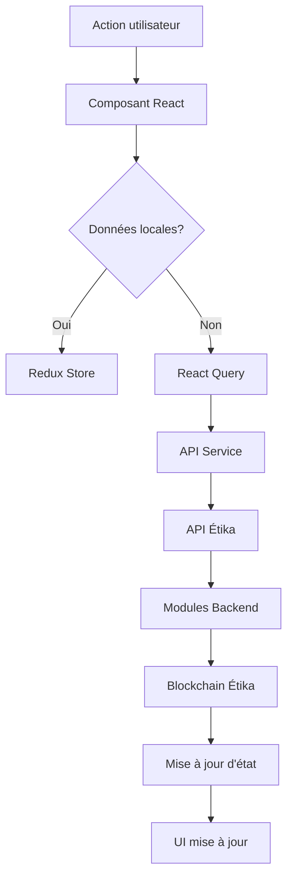

# Architecture Frontend du Portail Commerçant Étika

## 1. Vue d'ensemble

Le portail commerçant est une interface web moderne et responsive qui permet aux commerçants d'interagir avec l'écosystème Étika. Il s'agit principalement d'un tableau de bord pour gérer les transactions, les relations avec les fournisseurs et les opérations d'affacturage.

## 2. Technologies et choix techniques

### 2.1 Stack technologique
- Framework: **React 18+**
- Langage: **TypeScript**
- Gestion d'état: **Redux Toolkit** + **React Query** pour les requêtes API
- Routage: **React Router v6**
- Composants UI: **Material UI** (ou alternative comme **Ant Design**)
- Formulaires: **React Hook Form**
- Validation: **Zod**
- Graphiques/visualisations: **Recharts**
- QR Code: **react-qr-code**
- Tests: **Jest** + **React Testing Library**

### 2.2 Structure du projet

```
/src
  /app                   # Configuration d'application
    store.ts             # Store Redux
    router.tsx           # Configuration des routes
    theme.ts             # Thème de l'application
  
  /features              # Modules fonctionnels organisés par domaine
    /auth                # Authentification
    /dashboard           # Tableau de bord principal
    /transactions        # Gestion des transactions
    /suppliers           # Gestion des fournisseurs
    /factoring           # Opérations d'affacturage
    /settings            # Paramètres du compte
  
  /components            # Composants réutilisables
    /ui                  # Composants d'interface génériques
    /layout              # Composants de mise en page
    /forms               # Composants de formulaire réutilisables
    /charts              # Composants de visualisation
    /modals              # Fenêtres modales
  
  /services              # Services et logique métier
    /api                 # Client API et hooks d'intégration
    /blockchain          # Intégration avec la blockchain Étika
    /qrCode              # Service de génération de QR codes
  
  /utils                 # Utilitaires et fonctions d'aide
    /formatters          # Formatage des données (dates, montants, etc.)
    /validators          # Fonctions de validation
    /constants           # Constantes de l'application
  
  /types                 # Définitions TypeScript
    /api                 # Types pour les réponses API
    /entities            # Types pour les entités métier
    /blockchain          # Types liés à la blockchain
```

## 3. Architecture des données et flux

### 3.1 Modèle de données principal

Les principales entités manipulées par le portail commerçant sont:

- **Profil commerçant**: Informations sur le commerçant
- **Transaction PoP**: Détails d'une transaction avec preuve d'achat
- **Relation fournisseur**: Relation commerciale avec un fournisseur
- **Conditions d'affacturage**: Termes pour les paiements d'affacturage
- **Token Étika**: Gestion des tokens pour le commerçant

### 3.2 Flux de données



## 4. Composants principaux

### 4.1 Layout global
- **NavBar**: Navigation principale et statut de connexion
- **Sidebar**: Menu de navigation contextuel
- **AppShell**: Structure globale de l'application
- **Footer**: Informations de pied de page et support

### 4.2 Tableau de bord principal
- **DashboardOverview**: Résumé des métriques et activités
- **TransactionsSummary**: Résumé des transactions récentes
- **TokensWidget**: Affichage du solde de tokens
- **SuppliersList**: Liste des fournisseurs actifs
- **ActivityFeed**: Flux d'activité récente

### 4.3 Gestion des transactions
- **TransactionsList**: Liste paginée des transactions
- **TransactionDetails**: Détails d'une transaction spécifique
- **TransactionCreator**: Formulaire de création de transaction
- **QRCodeGenerator**: Générateur de QR code pour transactions PoP
- **TransactionScanner**: Scanner de QR code pour validation
- **TransactionFilters**: Filtres pour la liste des transactions

### 4.4 Gestion des fournisseurs
- **SupplierDirectory**: Répertoire des fournisseurs
- **SupplierProfile**: Profil détaillé d'un fournisseur
- **RelationshipManager**: Gestion des relations commerciales
- **FactoringTermsEditor**: Éditeur de conditions d'affacturage
- **SupplierInvite**: Système d'invitation de nouveaux fournisseurs

### 4.5 Système d'affacturage
- **FactoringDashboard**: Tableau de bord d'affacturage
- **PaymentSchedule**: Calendrier des paiements
- **LiquidityMonitor**: Surveillance de la liquidité
- **PaymentHistory**: Historique des paiements

## 5. Intégration API

### 5.1 Endpoints principaux

Le portail communiquera avec les endpoints suivants:

- **/api/auth**: Authentification et gestion de session
- **/api/merchant**: Informations sur le commerçant
- **/api/transactions**: Gestion des transactions PoP
- **/api/suppliers**: Gestion des relations fournisseurs
- **/api/factoring**: Opérations d'affacturage
- **/api/tokens**: Gestion des tokens

### 5.2 Stratégie d'intégration

Utilisation de React Query pour:
- Mise en cache optimisé des données
- Revalidation automatique
- Gestion des états de chargement et d'erreur
- Mutations avec optimistic updates

## 6. Authentification et sécurité

- Authentification basée sur JWT
- Refresh tokens pour sessions persistantes
- Protection CSRF pour les requêtes sensibles
- Validation côté client des entrées utilisateur
- Gestion granulaire des permissions

## 7. Expérience utilisateur

### 7.1 Principes UX
- Interface intuitive adaptée aux besoins des commerçants
- Feedback visuel immédiat pour les actions utilisateur
- Formulaires progressifs pour les opérations complexes
- Indicateurs de progression clairs pour les processus multi-étapes
- Modèles et assistants pour les tâches courantes

### 7.2 Responsive design
- Approche Mobile-first
- Breakpoints adaptés à différents appareils
- Optimisation pour tablettes (usage fréquent en commerce)
- Interfaces alternatives pour petits écrans

## 8. Accessibilité

- Conformité WCAG 2.1 AA
- Support de la navigation au clavier
- Compatibilité avec les lecteurs d'écran
- Contraste suffisant pour les éléments visuels
- Messages d'erreur explicites et accessibles

## 9. Performance

- Code-splitting basé sur les routes
- Lazy-loading des composants lourds
- Optimisation des re-rendus avec React.memo et useMemo
- Mise en cache stratégique des données
- Chargement progressif des listes longues

## 10. Monitoring et analytics

- Intégration de traces d'usage pour UX (sans données personnelles)
- Monitoring des erreurs frontend
- Mesures de performance (Web Vitals)
- Feedback utilisateur intégré
