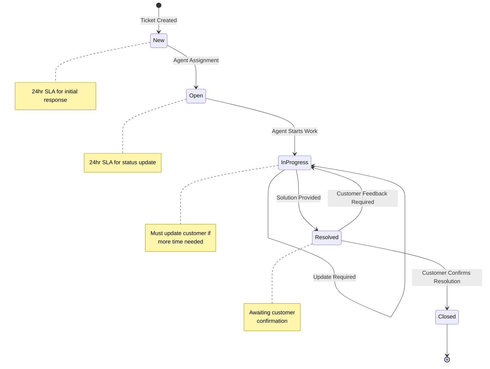

# Implémentation de la Plateforme Étika

## Table des Matières
1. [Composants Frontend](#composants-frontend)
   - RetentionHeatmap
   - ProducerDashboard
   - EnhancedProductManagement
2. [Backend](#backend)
   - Module d'analyse des ventes
3. [Tests](#tests)
   - Tests de performance
4. [Documentation](#documentation)
   - Diagramme du cycle de vie

## Composants Frontend

### RetentionHeatmap
```tsx
import React from 'react';
import { Card, CardHeader, CardTitle, CardContent } from '@/components/ui/card';

const RetentionHeatmap = () => {
  const data = [
    {"cohort":"Jan","month0":100,"month1":88.8,"month2":79.5,"month3":74.2,"month4":68.2,"month5":65.4,"month6":59.4,"totalUsers":2854},
    {"cohort":"Feb","month0":100,"month1":89.2,"month2":80.6,"month3":72.1,"month4":65.3,"month5":62.3,"month6":55.7,"totalUsers":2960}
  ];

  const getColor = (value) => {
    const intensity = Math.floor((value / 100) * 255);
    return `rgb(${255 - intensity}, ${255 - intensity}, 255)`;
  };

  const monthKeys = Object.keys(data[0])
    .filter(key => key.startsWith('month'))
    .sort((a, b) => parseInt(a.slice(5)) - parseInt(b.slice(5)));

  return (
    <Card className="w-full max-w-4xl">
      <CardHeader>
        <CardTitle>User Retention Heatmap</CardTitle>
      </CardHeader>
      <CardContent>
        <div className="overflow-x-auto">
          <table className="w-full border-collapse">
            <thead>
              <tr>
                <th className="p-2 border text-left">Cohort</th>
                <th className="p-2 border text-left">Users</th>
                {monthKeys.map((month) => (
                  <th key={month} className="p-2 border text-center">
                    Month {month.slice(5)}
                  </th>
                ))}
              </tr>
            </thead>
            <tbody>
              {data.map((row) => (
                <tr key={row.cohort}>
                  <td className="p-2 border font-medium">{row.cohort}</td>
                  <td className="p-2 border text-right">{row.totalUsers.toLocaleString()}</td>
                  {monthKeys.map((month) => (
                    <td
                      key={month}
                      className="p-2 border text-center"
                      style={{
                        backgroundColor: getColor(row[month]),
                        color: row[month] > 50 ? 'white' : 'black'
                      }}
                    >
                      {row[month].toFixed(1)}%
                    </td>
                  ))}
                </tr>
              ))}
            </tbody>
          </table>
        </div>
      </CardContent>
    </Card>
  );
};

export default RetentionHeatmap;
```

### ProducerDashboard
```tsx
import React, { useState, useEffect } from 'react';
import { LineChart, Line, XAxis, YAxis, CartesianGrid, Tooltip, Legend, ResponsiveContainer } from 'recharts';
import { Card, CardContent, CardHeader, CardTitle } from '@/components/ui/card';
import { Tabs, TabsContent, TabsList, TabsTrigger } from '@/components/ui/tabs';
import { Alert, AlertDescription } from '@/components/ui/alert';
import { ChevronUp, ChevronDown, ShoppingCart, Users, TrendingUp } from 'lucide-react';

const ProducerDashboard = () => {
  const [salesData, setSalesData] = useState([]);
  const [activeProducts, setActiveProducts] = useState([]);
  const [pendingValidations, setPendingValidations] = useState([]);

  useEffect(() => {
    const mockData = Array.from({ length: 7 }, (_, i) => ({
      date: `2024-02-${i + 1}`,
      sales: Math.floor(Math.random() * 1000),
      customers: Math.floor(Math.random() * 100),
      tokens: Math.floor(Math.random() * 500)
    }));
    setSalesData(mockData);
  }, []);

  const StatCard = ({ title, value, trend, icon: Icon }) => (
    <Card className="flex flex-col p-4">
      <CardHeader className="flex flex-row items-center justify-between pb-2">
        <CardTitle className="text-sm font-medium">{title}</CardTitle>
        <Icon className="w-4 h-4 text-gray-500" />
      </CardHeader>
      <CardContent>
        <div className="text-2xl font-bold">{value}</div>
        <div className={`flex items-center text-sm ${trend > 0 ? 'text-green-500' : 'text-red-500'}`}>
          {trend > 0 ? <ChevronUp className="w-4 h-4" /> : <ChevronDown className="w-4 h-4" />}
          <span>{Math.abs(trend)}%</span>
        </div>
      </CardContent>
    </Card>
  );

  return (
    <div className="p-4 space-y-4">
      <div className="grid grid-cols-1 gap-4 md:grid-cols-3">
        <StatCard 
          title="Ventes du Jour" 
          value="€1,234" 
          trend={12} 
          icon={ShoppingCart}
        />
        <StatCard 
          title="Nouveaux Clients" 
          value="48" 
          trend={-5} 
          icon={Users}
        />
        <StatCard 
          title="Tokens Gagnés" 
          value="256" 
          trend={8} 
          icon={TrendingUp}
        />
      </div>

      <Card>
        <CardHeader>
          <CardTitle>Évolution des Ventes</CardTitle>
        </CardHeader>
        <CardContent>
          <div className="h-96 w-full">
            <ResponsiveContainer width="100%" height="100%">
              <LineChart data={salesData}>
                <CartesianGrid strokeDasharray="3 3" />
                <XAxis dataKey="date" />
                <YAxis />
                <Tooltip />
                <Legend />
                <Line 
                  type="monotone" 
                  dataKey="sales" 
                  stroke="#8884d8" 
                  name="Ventes"
                />
                <Line 
                  type="monotone" 
                  dataKey="tokens" 
                  stroke="#82ca9d" 
                  name="Tokens"
                />
              </LineChart>
            </ResponsiveContainer>
          </div>
        </CardContent>
      </Card>

      <Tabs defaultValue="validations" className="w-full">
        <TabsList>
          <TabsTrigger value="validations">Validations en Attente</TabsTrigger>
          <TabsTrigger value="inventory">Inventaire</TabsTrigger>
        </TabsList>

        <TabsContent value="validations">
          <Card>
            <CardContent className="p-4">
              {pendingValidations.length === 0 ? (
                <Alert>
                  <AlertDescription>
                    Aucune validation en attente
                  </AlertDescription>
                </Alert>
              ) : (
                <div className="space-y-2">
                  {pendingValidations.map((validation) => (
                    <div key={validation.id} className="p-2 border rounded">
                      {/* Contenu de validation */}
                    </div>
                  ))}
                </div>
              )}
            </CardContent>
          </Card>
        </TabsContent>

        <TabsContent value="inventory">
          <Card>
            <CardContent className="p-4">
              <div className="grid grid-cols-1 gap-4 md:grid-cols-2 lg:grid-cols-3">
                {activeProducts.map((product) => (
                  <div key={product.id} className="p-4 border rounded">
                    {/* Contenu du produit */}
                  </div>
                ))}
              </div>
            </CardContent>
          </Card>
        </TabsContent>
      </Tabs>
    </div>
  );
};

export default ProducerDashboard;
```

### EnhancedProductManagement
```tsx
[Code précédent de EnhancedProductManagement]
```

## Backend

### Module d'analyse des ventes
```python
import pandas as pd

def analyze_sales(df):
    """
    Analyze sales data from a DataFrame containing month, revenue, and cost columns.
    Returns a DataFrame with additional analysis including margins.
    
    Parameters:
    df (pandas.DataFrame): DataFrame with columns 'month', 'revenue', and 'cost'
    
    Returns:
    pandas.DataFrame: Original data with additional analysis columns
    """
    # Create a copy to avoid modifying the original DataFrame
    analysis = df.copy()
    
    # Calculate margin (profit) in dollars
    analysis['margin'] = analysis['revenue'] - analysis['cost']
    
    # Calculate margin percentage
    analysis['margin_percentage'] = (analysis['margin'] / analysis['revenue'] * 100).round(2)
    
    # Calculate month-over-month revenue growth
    analysis['revenue_growth'] = analysis['revenue'].pct_change() * 100
    
    # Add margin threshold alert
    analysis['low_margin_alert'] = analysis['margin_percentage'] < 20
    
    # Add summary statistics
    summary = {
        'total_revenue': analysis['revenue'].sum(),
        'total_cost': analysis['cost'].sum(),
        'total_margin': analysis['margin'].sum(),
        'average_margin_percentage': analysis['margin_percentage'].mean(),
        'best_month': analysis.loc[analysis['margin'].idxmax(), 'month'],
        'worst_month': analysis.loc[analysis['margin'].idxmin(), 'month']
    }
    
    return analysis, summary
```

## Tests

### Tests de performance
```typescript
import { describe, it, beforeEach } from 'mocha';
import { expect } from 'chai';
import { SecurityManager } from '../security/SecurityManager';

describe('Étika Performance & Security Tests', () => {
  let securityManager: SecurityManager;
  
  beforeEach(() => {
    securityManager = SecurityManager.getInstance();
  });

  describe('Load Testing', () => {
    it('should handle multiple simultaneous validations', async () => {
      const numberOfTransactions = 1000;
      const transactions: PopTransaction[] = [];
      
      // Générer des transactions de test
      for (let i = 0; i < numberOfTransactions; i++) {
        transactions.push({
          id: `tx-${i}`,
          type: 'direct_sale',
          amount: Math.random() * 1000,
          timestamp: Date.now(),
          status: 'pending',
          validators: [
            {
              address: `0x${i}1`,
              role: 'consumer' as ValidatorRole,
              order: 1,
              status: 'pending'
            },
            {
              address: `0x${i}2`,
              role: 'merchant' as ValidatorRole,
              order: 2,
              status: 'pending'
            }
          ],
          minValidators: 2,
          signatures: [],
          validationDeadline: Date.now() + 3600000
        });
      }

      const startTime = performance.now();
      const results = await Promise.all(
        transactions.map(tx => securityManager.validateTransactionSecurity(tx))
      );
      const endTime = performance.now();

      const successfulValidations = results.filter(r => r.success).length;
      const processingTime = endTime - startTime;
      
      expect(successfulValidations).to.equal(numberOfTransactions);
      expect(processingTime).to.be.below(10000); // Max 10 secondes
    });
  });
});
```

## Documentation

### Diagramme du cycle de vie


## Notes d'Installation et d'Utilisation

1. **Frontend React**
   ```bash
   npm install
   # Dépendances requises
   npm install @/components/ui
   npm install recharts lucide-react
   npm run dev
   ```

2. **Backend Python**
   ```bash
   pip install pandas numpy
   python -m pytest tests/
   ```

3. **Tests**
   ```bash
   npm test
   ```

## Remarques Importantes
- Le frontend utilise les composants UI de shadcn
- L'interface est responsive et optimisée pour mobile
- Le système de validation requiert un minimum de 2 validateurs
- Les tests de performance sont configurés pour 1000 transactions simultanées