# Archives Complètes du Code - Projet Étika Phase Test

Ce document contient une archive complète du code développé pour la phase test du projet Étika, organisée par composants principaux.

## Table des matières

1. [Système d'Enchères](#1-système-denchères)
2. [Certificats Numériques (NFT)](#2-certificats-numériques-nft)
3. [Plateforme Web](#3-plateforme-web)
4. [Application Mobile](#4-application-mobile)
5. [Schéma d'Intégration](#5-schéma-dintégration)

---

## 3. Plateforme Web

Code du serveur principal pour la plateforme web d'Étika.

```javascript
// server.js
// Serveur principal pour la plateforme web Étika

const express = require('express');
const mongoose = require('mongoose');
const cors = require('cors');
const morgan = require('morgan');
const session = require('express-session');
const passport = require('passport');
const MongoStore = require('connect-mongo');
const { createServer } = require('http');
const { Server } = require('socket.io');
const path = require('path');

// Import des routes
const authRoutes = require('./routes/auth');
const auctionRoutes = require('./routes/auctions');
const certificateRoutes = require('./routes/certificates');
const userRoutes = require('./routes/users');
const ngoRoutes = require('./routes/ngos');
const adminRoutes = require('./routes/admin');

// Import des services
const { initializeServices } = require('./services');

// Configuration
const app = express();
const httpServer = createServer(app);
const io = new Server(httpServer, {
  cors: {
    origin: process.env.CORS_ORIGIN || '*',
    methods: ['GET', 'POST'],
    credentials: true
  }
});

// Middleware
app.use(cors({
  origin: process.env.CORS_ORIGIN || '*',
  credentials: true
}));
app.use(express.json());
app.use(express.urlencoded({ extended: true }));
app.use(morgan('dev'));

// Session
app.use(session({
  secret: process.env.SESSION_SECRET || 'etika-secret-key',
  resave: false,
  saveUninitialized: false,
  store: MongoStore.create({ 
    mongoUrl: process.env.MONGODB_URI || 'mongodb://localhost:27017/etika',
    ttl: 14 * 24 * 60 * 60 // 14 jours
  }),
  cookie: {
    secure: process.env.NODE_ENV === 'production',
    maxAge: 14 * 24 * 60 * 60 * 1000
  }
}));

// Authentification
app.use(passport.initialize());
app.use(passport.session());
require('./config/passport')(passport);

// Stockage statique
app.use(express.static(path.join(__dirname, 'public')));

// Initialisation des services
const services = initializeServices(io);

// Middleware pour injecter les services
app.use((req, res, next) => {
  req.services = services;
  next();
});

// Routes
app.use('/api/auth', authRoutes);
app.use('/api/auctions', auctionRoutes);
app.use('/api/certificates', certificateRoutes);
app.use('/api/users', userRoutes);
app.use('/api/ngos', ngoRoutes);
app.use('/api/admin', adminRoutes);

// Route pour servir l'application React en production
if (process.env.NODE_ENV === 'production') {
  app.use(express.static(path.join(__dirname, '../client/build')));
  
  app.get('*', (req, res) => {
    res.sendFile(path.join(__dirname, '../client/build', 'index.html'));
  });
}

// Gestion des erreurs
app.use((err, req, res, next) => {
  console.error(err.stack);
  res.status(err.status || 500).json({
    error: {
      message: err.message || 'Une erreur est survenue',
      status: err.status || 500
    }
  });
});

// Configuration de Socket.IO
io.on('connection', (socket) => {
  console.log('Client connecté:', socket.id);
  
  // Gestion des événements en temps réel
  socket.on('join-auction', (auctionId) => {
    socket.join(`auction-${auctionId}`);
    console.log(`Client ${socket.id} a rejoint l'enchère ${auctionId}`);
  });
  
  socket.on('leave-auction', (auctionId) => {
    socket.leave(`auction-${auctionId}`);
    console.log(`Client ${socket.id} a quitté l'enchère ${auctionId}`);
  });
  
  socket.on('disconnect', () => {
    console.log('Client déconnecté:', socket.id);
  });
});

// Connexion à la base de données et démarrage du serveur
mongoose.connect(process.env.MONGODB_URI || 'mongodb://localhost:27017/etika')
  .then(() => {
    console.log('Connexion à MongoDB établie');
    const PORT = process.env.PORT || 5000;
    httpServer.listen(PORT, () => {
      console.log(`Serveur en écoute sur le port ${PORT}`);
    });
  })
  .catch(err => {
    console.error('Erreur de connexion à MongoDB:', err);
    process.exit(1);
  });

// Exportation pour les tests
module.exports = app;
```

Interface utilisateur React pour la plateforme web d'Étika.

```javascript
// src/App.js
// Application React pour l'interface utilisateur d'Étika

import React, { useEffect, useState } from 'react';
import { BrowserRouter as Router, Routes, Route, Navigate } from 'react-router-dom';
import { ThemeProvider, createTheme } from '@mui/material/styles';
import CssBaseline from '@mui/material/CssBaseline';
import { io } from 'socket.io-client';

// Contextes
import { AuthProvider, useAuth } from './contexts/AuthContext';
import { NotificationProvider } from './contexts/NotificationContext';

// Composants de page
import HomePage from './pages/HomePage';
import LoginPage from './pages/LoginPage';
import RegisterPage from './pages/RegisterPage';
import AuctionsPage from './pages/AuctionsPage';
import AuctionDetailPage from './pages/AuctionDetailPage';
import CertificatesPage from './pages/CertificatesPage';
import CertificateDetailPage from './pages/CertificateDetailPage';
import ProfilePage from './pages/ProfilePage';
import NGOSpacePage from './pages/NGOSpacePage';
import AdminDashboard from './pages/admin/AdminDashboard';
import AboutPage from './pages/AboutPage';
import NotFoundPage from './pages/NotFoundPage';

// Composants de layout
import Layout from './components/Layout';
import Notification from './components/Notification';
import LoadingScreen from './components/LoadingScreen';

// Styles et thème
import './styles/global.css';

// Création du thème Étika
const theme = createTheme({
  palette: {
    primary: {
      main: '#2E7D32', // Vert nature
      light: '#4CAF50',
      dark: '#1B5E20',
      contrastText: '#FFFFFF',
    },
    secondary: {
      main: '#1976D2', // Bleu social
      light: '#42A5F5',
      dark: '#0D47A1',
      contrastText: '#FFFFFF',
    },
    error: {
      main: '#D32F2F',
    },
    warning: {
      main: '#FFA000',
    },
    info: {
      main: '#0288D1',
    },
    success: {
      main: '#388E3C',
    },
    background: {
      default: '#F5F7FA',
      paper: '#FFFFFF',
    },
    text: {
      primary: '#1F2937',
      secondary: '#4B5563',
    },
  },
  typography: {
    fontFamily: "'Poppins', 'Roboto', 'Arial', sans-serif",
    h1: {
      fontWeight: 700,
    },
    h2: {
      fontWeight: 600,
    },
    h3: {
      fontWeight: 600,
    },
    h4: {
      fontWeight: 600,
    },
    h5: {
      fontWeight: 500,
    },
    h6: {
      fontWeight: 500,
    },
    button: {
      fontWeight: 500,
      textTransform: 'none',
    },
  },
  shape: {
    borderRadius: 8,
  },
  shadows: [
    'none',
    '0px 2px 4px rgba(31, 41, 55, 0.06)',
    '0px 4px 6px rgba(31, 41, 55, 0.1)',
    // ... autres niveaux d'ombre
    '0px 20px 25px rgba(31, 41, 55, 0.15)',
  ],
  components: {
    MuiButton: {
      styleOverrides: {
        root: {
          borderRadius: 8,
          padding: '10px 22px',
        },
        containedPrimary: {
          '&:hover': {
            backgroundColor: '#388E3C',
          },
        },
      },
    },
    MuiCard: {
      styleOverrides: {
        root: {
          borderRadius: 12,
          boxShadow: '0px 4px 8px rgba(31, 41, 55, 0.08)',
        },
      },
    },
  },
});

// Composant principal de l'application
const App = () => {
  const [socket, setSocket] = useState(null);
  
  useEffect(() => {
    // Connexion à Socket.IO
    const socketInstance = io(process.env.REACT_APP_API_URL || 'http://localhost:5000');
    setSocket(socketInstance);
    
    return () => {
      if (socketInstance) socketInstance.disconnect();
    };
  }, []);
  
  return (
    <ThemeProvider theme={theme}>
      <CssBaseline />
      <AuthProvider>
        <NotificationProvider>
          <Router>
            <AppRoutes socket={socket} />
            <Notification />
          </Router>
        </NotificationProvider>
      </AuthProvider>
    </ThemeProvider>
  );
};

// Routes de l'application avec protection d'authentification
const AppRoutes = ({ socket }) => {
  const { user, loading } = useAuth();
  
  if (loading) {
    return <LoadingScreen />;
  }
  
  return (
    <Routes>
      <Route path="/" element={<Layout />}>
        <Route index element={<HomePage />} />
        <Route path="login" element={!user ? <LoginPage /> : <Navigate to="/" />} />
        <Route path="register" element={!user ? <RegisterPage /> : <Navigate to="/" />} />
        <Route path="auctions" element={<AuctionsPage socket={socket} />} />
        <Route path="auctions/:id" element={<AuctionDetailPage socket={socket} />} />
        <Route path="certificates" element={user ? <CertificatesPage /> : <Navigate to="/login" />} />
        <Route path="certificates/:id" element={<CertificateDetailPage />} />
        <Route path="profile" element={user ? <ProfilePage /> : <Navigate to="/login" />} />
        <Route path="ngo/:id" element={<NGOSpacePage />} />
        <Route path="about" element={<AboutPage />} />
        
        {/* Routes Admin (protégées) */}
        <Route 
          path="admin/*" 
          element={user && user.role === 'admin' ? <AdminDashboard /> : <Navigate to="/" />} 
        />
        
        {/* Route 404 */}
        <Route path="*" element={<NotFoundPage />} />
      </Route>
    </Routes>
  );
};

export default App;
```

---

## 4. Application Mobile

Application mobile React Native pour la phase événementielle d'Étika.

```javascript
// App.js
// Application mobile React Native pour Étika

import React, { useEffect, useState } from 'react';
import { StatusBar, LogBox } from 'react-native';
import { NavigationContainer } from '@react-navigation/native';
import { createNativeStackNavigator } from '@react-navigation/native-stack';
import { createBottomTabNavigator } from '@react-navigation/bottom-tabs';
import { SafeAreaProvider } from 'react-native-safe-area-context';
import AsyncStorage from '@react-native-async-storage/async-storage';
import { io } from 'socket.io-client';
import { Provider as PaperProvider } from 'react-native-paper';
import { MaterialCommunityIcons } from '@expo/vector-icons';

// Ignorez certains avertissements non critiques
LogBox.ignoreLogs([
  'ViewPropTypes will be removed',
  'AsyncStorage has been extracted from react-native',
]);

// Contextes
import { AuthProvider, useAuth } from './contexts/AuthContext';
import { NotificationProvider } from './contexts/NotificationContext';

// Écrans
import HomeScreen from './screens/HomeScreen';
import LoginScreen from './screens/LoginScreen';
import RegisterScreen from './screens/RegisterScreen';
import AuctionsScreen from './screens/AuctionsScreen';
import AuctionDetailScreen from './screens/AuctionDetailScreen';
import CertificatesScreen from './screens/CertificatesScreen';
import CertificateDetailScreen from './screens/CertificateDetailScreen';
import ProfileScreen from './screens/ProfileScreen';
import NGOSpaceScreen from './screens/NGOSpaceScreen';
import ScannerScreen from './screens/ScannerScreen';
import OnboardingScreen from './screens/OnboardingScreen';
import ReferralScreen from './screens/ReferralScreen';

// Composants
import LoadingScreen from './components/LoadingScreen';
import NotificationOverlay from './components/NotificationOverlay';

// Thème et styles
import { theme } from './styles/theme';

// Services
import { API_URL } from './config';

// Créer les navigateurs
const Stack = createNativeStackNavigator();
const Tab = createBottomTabNavigator();
const AuthStack = createNativeStackNavigator();
const MainStack = createNativeStackNavigator();

// Navigateur d'authentification
const AuthNavigator = () => (
  <AuthStack.Navigator 
    screenOptions={{ 
      headerShown: false,
      animation: 'fade'
    }}
  >
    <AuthStack.Screen name="Login" component={LoginScreen} />
    <AuthStack.Screen name="Register" component={RegisterScreen} />
  </AuthStack.Navigator>
);

// Navigateur principal avec tabs
const TabNavigator = () => {
  return (
    <Tab.Navigator
      screenOptions={({ route }) => ({
        tabBarIcon: ({ focused, color, size }) => {
          let iconName;

          if (route.name === 'Home') {
            iconName = focused ? 'home' : 'home-outline';
          } else if (route.name === 'Auctions') {
            iconName = focused ? 'gavel' : 'gavel';
          } else if (route.name === 'Certificates') {
            iconName = focused ? 'certificate' : 'certificate-outline';
          } else if (route.name === 'Scan') {
            iconName = focused ? 'qrcode-scan' : 'qrcode-scan';
          } else if (route.name === 'Profile') {
            iconName = focused ? 'account' : 'account-outline';
          }

          return <MaterialCommunityIcons name={iconName} size={size} color={color} />;
        },
        tabBarActiveTintColor: theme.colors.primary,
        tabBarInactiveTintColor: 'gray',
        headerShown: false,
      })}
    >
      <Tab.Screen name="Home" component={HomeScreen} />
      <Tab.Screen name="Auctions" component={AuctionsScreen} />
      <Tab.Screen name="Certificates" component={CertificatesScreen} />
      <Tab.Screen name="Scan" component={ScannerScreen} />
      <Tab.Screen name="Profile" component={ProfileScreen} />
    </Tab.Navigator>
  );
};

// Navigateur principal (après authentification)
const MainNavigator = () => (
  <MainStack.Navigator
    screenOptions={{
      headerStyle: {
        backgroundColor: theme.colors.primary,
      },
      headerTintColor: '#fff',
    }}
  >
    <MainStack.Screen 
      name="Tabs" 
      component={TabNavigator} 
      options={{ headerShown: false }}
    />
    <MainStack.Screen 
      name="AuctionDetail" 
      component={AuctionDetailScreen} 
      options={({ route }) => ({ title: route.params?.title || 'Enchère' })}
    />
    <MainStack.Screen 
      name="CertificateDetail" 
      component={CertificateDetailScreen} 
      options={({ route }) => ({ title: route.params?.title || 'Certificat' })}
    />
    <MainStack.Screen 
      name="NGOSpace" 
      component={NGOSpaceScreen} 
      options={({ route }) => ({ title: route.params?.name || 'Espace ONG' })}
    />
    <MainStack.Screen 
      name="Referral" 
      component={ReferralScreen} 
      options={{ title: 'Parrainage' }}
    />
  </MainStack.Navigator>
);

// Navigation principale de l'application
const AppNavigator = () => {
  const { user, loading, isFirstLaunch } = useAuth();
  
  if (loading) {
    return <LoadingScreen />;
  }
  
  return (
    <NavigationContainer theme={theme.navigation}>
      <Stack.Navigator screenOptions={{ headerShown: false }}>
        {isFirstLaunch ? (
          <Stack.Screen name="Onboarding" component={OnboardingScreen} />
        ) : user ? (
          <Stack.Screen name="Main" component={MainNavigator} />
        ) : (
          <Stack.Screen name="Auth" component={AuthNavigator} />
        )}
      </Stack.Navigator>
    </NavigationContainer>
  );
};

// Composant principal de l'application
const App = () => {
  const [socket, setSocket] = useState(null);
  
  useEffect(() => {
    // Initialisation de Socket.IO
    const socketInstance = io(API_URL);
    setSocket(socketInstance);
    
    return () => {
      if (socketInstance) socketInstance.disconnect();
    };
  }, []);
  
  return (
    <SafeAreaProvider>
      <StatusBar barStyle="dark-content" backgroundColor="#FFFFFF" />
      <PaperProvider theme={theme.paper}>
        <AuthProvider>
          <NotificationProvider>
            <AppNavigator />
            <NotificationOverlay />
          </NotificationProvider>
        </AuthProvider>
      </PaperProvider>
    </SafeAreaProvider>
  );
};

export default App;
```

---

## 5. Schéma d'Intégration

Schéma d'intégration des composants du projet Étika (en format Mermaid).

```mermaid
flowchart TD
    subgraph Frontend[Frontend]
        direction TB
        WebApp[Plateforme Web React]
        MobileApp[Application Mobile React Native]
    end

    subgraph Backend[Backend Services]
        direction TB
        API[API Express]
        Socket[Service Socket.IO]
        AuctionService[Service d'Enchères]
        UserService[Service Utilisateurs]
        CertificateService[Service Certificats]
        NGOService[Service ONG]
        AdminService[Service Admin]
        EventService[Service d'Événements]
        NotificationService[Service de Notifications]
    end

    subgraph Storage[Stockage]
        MongoDB[(Base de données MongoDB)]
        FileStorage[Stockage de Fichiers]
    end

    subgraph Blockchain[Infrastructure Blockchain]
        ContractNFT[Smart Contract NFT]
        TokenContract[Smart Contract Token]
        IPFS[Stockage IPFS]
        PolygonNode[Nœud Polygon/Tezos]
    end

    subgraph External[Services Externes]
        AIImageGen[Service Génération d'Images IA]
        EmailService[Service Email]
        SMSService[Service SMS]
        PaymentGateway[Passerelle de Paiement]
    end

    %% Connexions Frontend
    WebApp <--> API
    MobileApp <--> API
    WebApp <--> Socket
    MobileApp <--> Socket

    %% Connexions Backend
    API --> AuctionService
    API --> UserService
    API --> CertificateService
    API --> NGOService
    API --> AdminService
    API --> EventService
    API --> NotificationService
    
    Socket <--> EventService
    NotificationService --> Socket
    EventService --> NotificationService

    %% Connexions Storage
    AuctionService <--> MongoDB
    UserService <--> MongoDB
    CertificateService <--> MongoDB
    NGOService <--> MongoDB
    AdminService <--> MongoDB
    EventService <--> MongoDB
    NotificationService <--> MongoDB
    
    CertificateService <--> FileStorage
    NGOService <--> FileStorage
    UserService <--> FileStorage

    %% Connexions Blockchain
    CertificateService <--> ContractNFT
    CertificateService <--> IPFS
    ContractNFT <--> PolygonNode
    TokenContract <--> PolygonNode
    FileStorage <--> IPFS

    %% Connexions Services Externes
    CertificateService <--> AIImageGen
    UserService <--> EmailService
    UserService <--> SMSService
    NotificationService <--> EmailService
    NotificationService <--> SMSService
    AuctionService <--> PaymentGateway

    %% Légende
    classDef frontendClass fill:#d1f0ee,stroke:#333,stroke-width:1px
    classDef backendClass fill:#d4f1c5,stroke:#333,stroke-width:1px
    classDef storageClass fill:#f5e8b3,stroke:#333,stroke-width:1px
    classDef blockchainClass fill:#e0c5f5,stroke:#333,stroke-width:1px
    classDef externalClass fill:#f5c5c5,stroke:#333,stroke-width:1px
    
    class WebApp,MobileApp frontendClass
    class API,Socket,AuctionService,UserService,CertificateService,NGOService,AdminService,EventService,NotificationService backendClass
    class MongoDB,FileStorage storageClass
    class ContractNFT,TokenContract,IPFS,PolygonNode blockchainClass
    class AIImageGen,EmailService,SMSService,PaymentGateway externalClass
```



## 1. Système d'Enchères

Fichier principal du système de gestion des enchères pour la phase événementielle d'Étika.

```javascript
// auction-system.js
// Système d'enchères pour la phase événementielle d'Étika

const { ethers } = require('ethers');
const { v4: uuidv4 } = require('uuid');

/**
 * Classe principale pour gérer les enchères Étika
 */
class EtikaAuctionSystem {
  constructor(dbProvider, blockchainProvider, adminService) {
    this.db = dbProvider;
    this.blockchain = blockchainProvider;
    this.adminService = adminService;
    this.activeAuctions = new Map();
  }

  /**
   * Crée une nouvelle salle d'enchères
   * @param {Object} auctionData - Données de base pour l'enchère
   * @returns {String} - ID de l'enchère créée
   */
  async createAuction(auctionData) {
    try {
      const auctionId = uuidv4();
      
      const newAuction = {
        id: auctionId,
        category: auctionData.category,
        title: auctionData.title,
        description: auctionData.description,
        startTime: auctionData.startTime,
        endTime: auctionData.endTime,
        startingPrice: auctionData.startingPrice,
        minBidIncrement: auctionData.minBidIncrement || 100,
        status: 'pending', // pending, active, completed, cancelled
        bids: [],
        createdAt: Date.now(),
        updatedAt: Date.now(),
        adminValidation: false,
        participants: [],
        winningBid: null,
      };
      
      // Vérification et validation des données
      this._validateAuctionData(newAuction);
      
      // Enregistrer dans la base de données
      await this.db.auctions.insert(newAuction);
      
      // Si l'enchère commence immédiatement, l'activer
      if (newAuction.startTime <= Date.now()) {
        await this.activateAuction(auctionId);
      } else {
        // Planifier l'activation automatique
        this._scheduleAuctionActivation(auctionId, newAuction.startTime);
      }
      
      // Notifier les administrateurs pour validation si nécessaire
      await this.adminService.notifyNewAuction(auctionId);
      
      return auctionId;
    } catch (error) {
      console.error("Erreur lors de la création de l'enchère:", error);
      throw new Error(`Échec de création de l'enchère: ${error.message}`);
    }
  }
  
  /**
   * Active une enchère en attente
   * @param {String} auctionId - ID de l'enchère
   */
  async activateAuction(auctionId) {
    const auction = await this.db.auctions.findOne({ id: auctionId });
    if (!auction) throw new Error("Enchère non trouvée");
    
    if (auction.status !== 'pending') {
      throw new Error(`L'enchère ne peut pas être activée depuis l'état: ${auction.status}`);
    }
    
    // Mettre à jour le statut
    await this.db.auctions.update(
      { id: auctionId },
      { $set: { status: 'active', updatedAt: Date.now() } }
    );
    
    // Enregistrer l'enchère active en mémoire pour une gestion rapide
    this.activeAuctions.set(auctionId, {
      ...auction,
      status: 'active',
      updatedAt: Date.now()
    });
    
    // Planifier la finalisation automatique
    this._scheduleAuctionFinalization(auctionId, auction.endTime);
    
    // Émettre un événement
    this._emitAuctionEvent('auction_activated', auctionId);
    
    return true;
  }
  
  /**
   * Soumet une enchère
   * @param {String} auctionId - ID de l'enchère
   * @param {String} bidderId - ID de l'enchérisseur
   * @param {Number} amount - Montant de l'enchère
   * @returns {Object} - Détails de l'enchère placée
   */
  async placeBid(auctionId, bidderId, amount) {
    const auction = await this._getActiveAuction(auctionId);
    
    // Vérifier que l'enchère est active
    if (auction.status !== 'active') {
      throw new Error("Impossible de placer une enchère: l'enchère n'est pas active");
    }
    
    // Vérifier que l'enchère n'est pas terminée
    if (auction.endTime <= Date.now()) {
      throw new Error("Impossible de placer une enchère: l'enchère est terminée");
    }
    
    // Vérifier que le montant est valide
    const highestBid = this._getHighestBid(auction);
    const minimumBid = highestBid 
      ? highestBid.amount + auction.minBidIncrement
      : auction.startingPrice;
    
    if (amount < minimumBid) {
      throw new Error(`L'enchère doit être d'au moins ${minimumBid}`);
    }
    
    // Vérifier la solvabilité de l'enchérisseur
    await this._verifyBidderSolvency(bidderId, amount);
    
    // Créer l'objet d'enchère
    const bid = {
      id: uuidv4(),
      auctionId,
      bidderId,
      amount,
      timestamp: Date.now(),
      status: 'active' // active, cancelled, winning
    };
    
    // Ajouter l'enchère à la base de données
    await this.db.bids.insert(bid);
    
    // Mettre à jour l'enchère
    await this.db.auctions.update(
      { id: auctionId },
      { 
        $push: { bids: bid.id },
        $addToSet: { participants: bidderId },
        $set: { updatedAt: Date.now() }
      }
    );
    
    // Mettre à jour l'enchère en mémoire
    const updatedAuction = await this.db.auctions.findOne({ id: auctionId });
    this.activeAuctions.set(auctionId, updatedAuction);
    
    // Prolonger l'enchère si nécessaire (anti-sniping)
    if (auction.endTime - Date.now() < 300000) { // moins de 5 minutes restantes
      const newEndTime = Date.now() + 300000; // + 5 minutes
      await this._extendAuctionTime(auctionId, newEndTime);
    }
    
    // Émettre un événement
    this._emitAuctionEvent('new_bid', auctionId, { bid });
    
    return bid;
  }
  
  /**
   * Finalise une enchère
   * @param {String} auctionId - ID de l'enchère
   * @returns {Object} - Résultat de la finalisation
   */
  async finalizeAuction(auctionId) {
    const auction = await this._getAuction(auctionId);
    
    if (auction.status !== 'active') {
      throw new Error(`L'enchère ne peut pas être finalisée depuis l'état: ${auction.status}`);
    }
    
    // Trouver l'enchère gagnante
    const allBids = await this._getAllAuctionBids(auctionId);
    const winningBid = allBids.length > 0 
      ? allBids.reduce((highest, current) => 
          current.amount > highest.amount ? current : highest
        )
      : null;
    
    let finalStatus;
    
    if (winningBid) {
      // Marquer l'enchère comme gagnante
      await this.db.bids.update(
        { id: winningBid.id },
        { $set: { status: 'winning' } }
      );
      
      // Transférer les fonds (via smart contract ou système de paiement)
      try {
        await this._processBidPayment(winningBid);
        finalStatus = 'completed';
      } catch (error) {
        console.error("Erreur lors du traitement du paiement:", error);
        finalStatus = 'payment_pending';
      }
    } else {
      finalStatus = 'failed'; // Aucune enchère placée
    }
    
    // Mettre à jour l'enchère
    await this.db.auctions.update(
      { id: auctionId },
      { 
        $set: { 
          status: finalStatus, 
          updatedAt: Date.now(),
          winningBid: winningBid ? winningBid.id : null,
          finalizedAt: Date.now()
        } 
      }
    );
    
    // Retirer l'enchère de la mémoire active
    this.activeAuctions.delete(auctionId);
    
    // Émettre un événement
    this._emitAuctionEvent('auction_finalized', auctionId, {
      finalStatus,
      winningBid: winningBid || null
    });
    
    return {
      auctionId,
      finalStatus,
      winningBid: winningBid || null
    };
  }
  
  /**
   * Récupère les détails d'une enchère
   * @param {String} auctionId - ID de l'enchère
   * @returns {Object} - Détails complets de l'enchère
   */
  async getAuctionDetails(auctionId) {
    const auction = await this._getAuction(auctionId);
    const bids = await this._getAllAuctionBids(auctionId);
    
    const enrichedAuction = {
      ...auction,
      bids: bids.sort((a, b) => b.timestamp - a.timestamp),
      currentHighestBid: bids.length > 0 
        ? bids.reduce((highest, current) => 
            current.amount > highest.amount ? current : highest
          )
        : null,
      timeRemaining: auction.status === 'active' 
        ? Math.max(0, auction.endTime - Date.now()) 
        : 0,
      participantCount: auction.participants.length
    };
    
    return enrichedAuction;
  }
  
  // Méthodes privées d'aide
  
  /**
   * Valide les données d'une enchère
   * @private
   */
  _validateAuctionData(auction) {
    if (!auction.category) throw new Error("La catégorie est requise");
    if (!auction.title) throw new Error("Le titre est requis");
    if (!auction.startTime || !auction.endTime) throw new Error("Les horaires sont requis");
    if (auction.startTime >= auction.endTime) throw new Error("La date de fin doit être ultérieure à la date de début");
    if (auction.startingPrice <= 0) throw new Error("Le prix de départ doit être positif");
    
    // Vérifier que la durée est raisonnable (entre 1h et 30 jours)
    const durationMs = auction.endTime - auction.startTime;
    if (durationMs < 3600000 || durationMs > 2592000000) {
      throw new Error("La durée de l'enchère doit être entre 1 heure et 30 jours");
    }
  }
  
  /**
   * Planifie l'activation automatique d'une enchère
   * @private
   */
  _scheduleAuctionActivation(auctionId, startTime) {
    const delayMs = Math.max(0, startTime - Date.now());
    setTimeout(() => {
      this.activateAuction(auctionId).catch(err => {
        console.error(`Erreur lors de l'activation automatique de l'enchère ${auctionId}:`, err);
      });
    }, delayMs);
  }
  
  /**
   * Planifie la finalisation automatique d'une enchère
   * @private
   */
  _scheduleAuctionFinalization(auctionId, endTime) {
    const delayMs = Math.max(0, endTime - Date.now());
    setTimeout(() => {
      this.finalizeAuction(auctionId).catch(err => {
        console.error(`Erreur lors de la finalisation automatique de l'enchère ${auctionId}:`, err);
      });
    }, delayMs);
  }
  
  /**
   * Récupère une enchère active de la mémoire ou de la base de données
   * @private
   */
  async _getActiveAuction(auctionId) {
    // Essayer d'abord la mémoire pour la performance
    if (this.activeAuctions.has(auctionId)) {
      return this.activeAuctions.get(auctionId);
    }
    
    // Sinon chercher dans la base de données
    const auction = await this.db.auctions.findOne({ id: auctionId });
    if (!auction) throw new Error("Enchère non trouvée");
    
    // Si l'enchère est active, la mettre en cache
    if (auction.status === 'active') {
      this.activeAuctions.set(auctionId, auction);
    }
    
    return auction;
  }
  
  /**
   * Récupère une enchère depuis la base de données
   * @private
   */
  async _getAuction(auctionId) {
    const auction = await this.db.auctions.findOne({ id: auctionId });
    if (!auction) throw new Error("Enchère non trouvée");
    return auction;
  }
  
  /**
   * Récupère toutes les enchères d'une catégorie
   * @private
   */
  async _getAuctionsByCategory(category, status = null) {
    const query = { category };
    if (status) query.status = status;
    return await this.db.auctions.find(query);
  }
  
  /**
   * Récupère l'enchère la plus élevée
   * @private
   */
  _getHighestBid(auction) {
    if (!auction.bids || auction.bids.length === 0) return null;
    
    // Trouve l'ID de l'enchère la plus élevée
    const highestBidId = auction.bids.reduce((highest, current) => {
      return current.amount > highest.amount ? current : highest;
    }).id;
    
    return highestBidId;
  }
  
  /**
   * Récupère toutes les enchères pour une vente aux enchères
   * @private
   */
  async _getAllAuctionBids(auctionId) {
    return await this.db.bids.find({ auctionId });
  }
  
  /**
   * Vérifie la solvabilité d'un enchérisseur
   * @private
   */
  async _verifyBidderSolvency(bidderId, amount) {
    // Implémentation dépendant du système de paiement intégré
    // Peut être une vérification de disponibilité de fonds, de crédit, etc.
    return true; // Simplification pour l'exemple
  }
  
  /**
   * Traite le paiement d'une enchère gagnante
   * @private
   */
  async _processBidPayment(bid) {
    // Implémentation dépendant du système de paiement
    // Pourrait utiliser un smart contract ou un système de paiement traditionnel
    
    // Exemple simplifié avec blockchain
    const paymentTx = await this.blockchain.submitTransaction({
      type: 'payment',
      from: bid.bidderId,
      amount: bid.amount,
      metadata: {
        auctionId: bid.auctionId,
        bidId: bid.id,
        timestamp: Date.now()
      }
    });
    
    return paymentTx;
  }
  
  /**
   * Prolonge la durée d'une enchère
   * @private
   */
  async _extendAuctionTime(auctionId, newEndTime) {
    await this.db.auctions.update(
      { id: auctionId },
      { $set: { endTime: newEndTime, updatedAt: Date.now() } }
    );
    
    // Mettre à jour l'enchère en mémoire
    if (this.activeAuctions.has(auctionId)) {
      const auction = this.activeAuctions.get(auctionId);
      auction.endTime = newEndTime;
      auction.updatedAt = Date.now();
      this.activeAuctions.set(auctionId, auction);
    }
    
    // Replanifier la finalisation
    this._scheduleAuctionFinalization(auctionId, newEndTime);
    
    // Émettre un événement
    this._emitAuctionEvent('auction_extended', auctionId, { newEndTime });
  }
  
  /**
   * Émet un événement d'enchère
   * @private
   */
  _emitAuctionEvent(eventType, auctionId, data = {}) {
    // Implémentation dépendant du système d'événements utilisé
    // Pourrait utiliser WebSockets, Server-Sent Events, etc.
    
    console.log(`[ÉVÉNEMENT] ${eventType} pour l'enchère ${auctionId}:`, data);
  }
}

module.exports = EtikaAuctionSystem;
```

---

## 2. Certificats Numériques (NFT)

Système de gestion des certificats numériques (NFT) pour la phase événementielle d'Étika.

```javascript
// digital-certificates.js
// Système de certificats numériques (NFT) pour la phase événementielle d'Étika

const { ethers } = require('ethers');
const { v4: uuidv4 } = require('uuid');
const axios = require('axios');

/**
 * Classe pour gérer les certificats numériques (NFT) d'Étika
 * Utilise une approche hybride: stockage en base de données + blockchain
 */
class EtikaDigitalCertificates {
  constructor(dbProvider, blockchainProvider, imageGenerationService) {
    this.db = dbProvider;
    this.blockchain = blockchainProvider; // Polygon, Tezos ou autre blockchain à faible empreinte
    this.imageService = imageGenerationService;
    this.certificateTypes = new Map(); // Cache des types de certificats
  }

  /**
   * Initialise les types de certificats disponibles
   * @returns {Promise<void>}
   */
  async initializeCertificateTypes() {
    // Charger les types de certificats depuis la base de données
    const types = await this.db.certificateTypes.find({});
    
    // Mettre en cache pour un accès rapide
    types.forEach(type => {
      this.certificateTypes.set(type.id, type);
    });
    
    if (types.length === 0) {
      // Créer des types par défaut si aucun n'existe
      await this._createDefaultCertificateTypes();
    }
  }
  
  /**
   * Crée un nouveau certificat numérique pour un utilisateur
   * @param {String} userId - ID de l'utilisateur
   * @param {String} certificateTypeId - Type de certificat
   * @param {Object} metadata - Métadonnées supplémentaires
   * @returns {Promise<Object>} - Le certificat créé
   */
  async createCertificate(userId, certificateTypeId, metadata = {}) {
    try {
      // Vérifier que le type de certificat existe
      if (!this.certificateTypes.has(certificateTypeId)) {
        throw new Error(`Type de certificat inconnu: ${certificateTypeId}`);
      }
      
      const certificateType = this.certificateTypes.get(certificateTypeId);
      
      // Générer un identifiant unique
      const certificateId = uuidv4();
      
      // Générer l'image du certificat
      const imageData = await this._generateCertificateImage(certificateType, userId, metadata);
      
      // Stocker l'image et récupérer l'URL
      const imageUrl = await this._storeCertificateImage(certificateId, imageData);
      
      // Préparer les métadonnées du certificat
      const certificateMetadata = {
        name: `${certificateType.name} #${certificateId.slice(0, 8)}`,
        description: certificateType.description,
        image: imageUrl,
        attributes: [
          {
            trait_type: 'Type',
            value: certificateType.name
          },
          {
            trait_type: 'Rareté',
            value: certificateType.rarity
          },
          ...this._generateAttributes(certificateType, metadata)
        ],
        created_at: new Date().toISOString(),
        etika_metadata: {
          user_id: userId,
          certificate_type: certificateTypeId,
          ...metadata
        }
      };
      
      // Stocker les métadonnées sur IPFS ou système de stockage décentralisé
      const metadataUri = await this._storeMetadata(certificateId, certificateMetadata);
      
      // Créer l'entrée du certificat en base de données
      const certificate = {
        id: certificateId,
        userId,
        certificateTypeId,
        metadataUri,
        imageUrl,
        status: 'active', // active, revoked, expired
        createdAt: Date.now(),
        updatedAt: Date.now(),
        onChain: false, // Indique si le certificat a été enregistré sur la blockchain
        onChainId: null, // Identifiant sur la blockchain
        customMetadata: metadata
      };
      
      // Enregistrer dans la base de données
      await this.db.certificates.insert(certificate);
      
      // Tenter l'enregistrement sur la blockchain (en arrière-plan)
      this._registerOnBlockchain(certificateId).catch(err => {
        console.error(`Erreur lors de l'enregistrement blockchain du certificat ${certificateId}:`, err);
      });
      
      return {
        ...certificate,
        metadata: certificateMetadata
      };
    } catch (error) {
      console.error("Erreur lors de la création du certificat:", error);
      throw new Error(`Échec de création du certificat: ${error.message}`);
    }
  }
  
  /**
   * Récupère un certificat numérique
   * @param {String} certificateId - ID du certificat
   * @returns {Promise<Object>} - Le certificat avec ses métadonnées
   */
  async getCertificate(certificateId) {
    const certificate = await this.db.certificates.findOne({ id: certificateId });
    if (!certificate) {
      throw new Error(`Certificat non trouvé: ${certificateId}`);
    }
    
    // Récupérer les métadonnées
    const metadata = await this._fetchMetadata(certificate.metadataUri);
    
    return {
      ...certificate,
      metadata
    };
  }
  
  /**
   * Récupère tous les certificats d'un utilisateur
   * @param {String} userId - ID de l'utilisateur
   * @returns {Promise<Array>} - Liste des certificats
   */
  async getUserCertificates(userId) {
    const certificates = await this.db.certificates.find({ userId });
    
    // Pour chaque certificat, récupérer le type
    const enrichedCertificates = await Promise.all(
      certificates.map(async cert => {
        const type = this.certificateTypes.get(cert.certificateTypeId);
        return {
          ...cert,
          type
        };
      })
    );
    
    return enrichedCertificates;
  }
  
  /**
   * Vérifie l'authenticité d'un certificat
   * @param {String} certificateId - ID du certificat
   * @returns {Promise<Object>} - Résultat de vérification
   */
  async verifyCertificate(certificateId) {
    const certificate = await this.db.certificates.findOne({ id: certificateId });
    if (!certificate) {
      return {
        valid: false,
        reason: 'not_found',
        message: 'Certificat non trouvé'
      };
    }
    
    // Vérifier le statut
    if (certificate.status !== 'active') {
      return {
        valid: false,
        reason: 'inactive',
        message: `Le certificat est ${certificate.status}`
      };
    }
    
    // Si le certificat est sur la blockchain, vérifier
    if (certificate.onChain && certificate.onChainId) {
      try {
        const blockchainVerification = await this._verifyOnBlockchain(certificate);
        if (!blockchainVerification.valid) {
          return blockchainVerification;
        }
      } catch (error) {
        return {
          valid: false,
          reason: 'blockchain_error',
          message: `Erreur de vérification blockchain: ${error.message}`
        };
      }
    }
    
    return {
      valid: true,
      certificateId,
      userId: certificate.userId,
      certificateType: certificate.certificateTypeId,
      issuedAt: new Date(certificate.createdAt).toISOString(),
      onChain: certificate.onChain
    };
  }
  
  /**
   * Crée un nouveau type de certificat
   * @param {Object} typeData - Données du type de certificat
   * @returns {Promise<Object>} - Le type créé
   */
  async createCertificateType(typeData) {
    const typeId = uuidv4();
    
    const certificateType = {
      id: typeId,
      name: typeData.name,
      description: typeData.description,
      rarity: typeData.rarity || 'common', // common, uncommon, rare, legendary
      imagePrompts: typeData.imagePrompts || [],
      attributeTemplates: typeData.attributeTemplates || [],
      ngoPartner: typeData.ngoPartner || null,
      maxSupply: typeData.maxSupply || 0, // 0 = illimité
      createdAt: Date.now(),
      updatedAt: Date.now(),
      active: true
    };
    
    // Vérifier les données
    if (!certificateType.name) throw new Error("Le nom du type est requis");
    if (!certificateType.description) throw new Error("La description du type est requise");
    
    // Insérer dans la base de données
    await this.db.certificateTypes.insert(certificateType);
    
    // Mettre à jour le cache
    this.certificateTypes.set(typeId, certificateType);
    
    return certificateType;
  }
  
  // Méthodes privées
  
  /**
   * Crée des types de certificats par défaut
   * @private
   */
  async _createDefaultCertificateTypes() {
    const defaultTypes = [
      {
        name: "Certificat Fondateur",
        description: "Certificat attribué aux membres fondateurs de la communauté Étika",
        rarity: "legendary",
        imagePrompts: ["nature", "growth", "foundation", "community"],
        attributeTemplates: [
          { name: "génération", valueType: "number", defaultValue: 1 }
        ]
      },
      {
        name: "Certificat Écologique",
        description: "Certificat représentant l'engagement envers la protection de l'environnement",
        rarity: "rare",
        imagePrompts: ["nature", "ecology", "earth", "green"],
        attributeTemplates: [
          { name: "élément", valueType: "string", possibleValues: ["eau", "terre", "air"] }
        ]
      },
      {
        name: "Certificat Social",
        description: "Certificat représentant l'engagement envers la justice sociale",
        rarity: "rare",
        imagePrompts: ["community", "solidarity", "equality", "hands"],
        attributeTemplates: [
          { name: "focus", valueType: "string", possibleValues: ["éducation", "santé", "inclusion"] }
        ]
      },
      {
        name: "Certificat Parrainage",
        description: "Certificat attribué pour avoir parrainé de nouveaux membres",
        rarity: "uncommon",
        imagePrompts: ["connection", "network", "growth", "sharing"],
        attributeTemplates: [
          { name: "parrainages", valueType: "number", defaultValue: 1 }
        ]
      }
    ];
    
    for (const typeData of defaultTypes) {
      await this.createCertificateType(typeData);
    }
  }
  
  /**
   * Génère une image pour un certificat
   * @private
   */
  async _generateCertificateImage(certificateType, userId, metadata) {
    // Utilisation du service d'IA pour générer une image
    const prompt = this._createImagePrompt(certificateType, metadata);
    
    try {
      const imageData = await this.imageService.generateImage({
        prompt,
        width: 1024,
        height: 1024,
        style: "etika",
        userId
      });
      
      return imageData;
    } catch (error) {
      console.error("Erreur lors de la génération d'image:", error);
      // Utiliser une image par défaut en cas d'échec
      return this._getDefaultImage(certificateType.id);
    }
  }
  
  /**
   * Crée un prompt pour la génération d'image
   * @private
   */
  _createImagePrompt(certificateType, metadata) {
    let basePrompt = `Certificate for Etika project, ${certificateType.description}, `;
    
    // Ajouter les prompts spécifiques au type de certificat
    if (certificateType.imagePrompts && certificateType.imagePrompts.length > 0) {
      basePrompt += certificateType.imagePrompts.join(", ") + ", ";
    }
    
    // Ajouter des éléments basés sur les métadonnées
    if (metadata.element) {
      basePrompt += `featuring ${metadata.element} element, `;
    }
    
    if (metadata.focus) {
      basePrompt += `focusing on ${metadata.focus}, `;
    }
    
    // Ajouter des instructions de style
    basePrompt += "digital art style, vibrant colors, inspiring, ethical values, sustainability, social justice";
    
    return basePrompt;
  }
  
  /**
   * Récupère une image par défaut en cas d'échec de génération
   * @private
   */
  _getDefaultImage(typeId) {
    // Implémentation avec des images prédéfinies par type
    const defaultImages = {
      "founder": "/assets/default-images/founder-certificate.png",
      "ecological": "/assets/default-images/ecological-certificate.png",
      "social": "/assets/default-images/social-certificate.png",
      "referral": "/assets/default-images/referral-certificate.png"
    };
    
    // Retourner l'image correspondante ou une image générique
    return defaultImages[typeId] || "/assets/default-images/generic-certificate.png";
  }
  
  /**
   * Stocke l'image d'un certificat
   * @private
   */
  async _storeCertificateImage(certificateId, imageData) {
    // Stocker l'image (dans un stockage cloud ou IPFS)
    const storageKey = `certificates/${certificateId}.png`;
    
    try {
      // Implémentation du stockage (AWS S3, IPFS, etc.)
      const uploadResult = await this.blockchain.storeFile(imageData, storageKey);
      return uploadResult.url;
    } catch (error) {
      console.error("Erreur lors du stockage de l'image:", error);
      throw new Error(`Échec de stockage de l'image: ${error.message}`);
    }
  }
  
  /**
   * Génère des attributs pour un certificat basé sur son type
   * @private
   */
  _generateAttributes(certificateType, metadata) {
    const attributes = [];
    
    if (certificateType.attributeTemplates) {
      for (const template of certificateType.attributeTemplates) {
        // Récupérer la valeur depuis les métadonnées ou utiliser la valeur par défaut
        let value = metadata[template.name] || template.defaultValue;
        
        // Si des valeurs possibles sont définies, vérifier que la valeur est valide
        if (template.possibleValues && value) {
          if (!template.possibleValues.includes(value)) {
            value = template.defaultValue || template.possibleValues[0];
          }
        }
        
        if (value !== undefined) {
          attributes.push({
            trait_type: template.name,
            value
          });
        }
      }
    }
    
    return attributes;
  }
  
  /**
   * Stocke les métadonnées d'un certificat
   * @private
   */
  async _storeMetadata(certificateId, metadata) {
    const metadataKey = `metadata/${certificateId}.json`;
    
    try {
      // Stocker les métadonnées (dans un stockage cloud ou IPFS)
      const uploadResult = await this.blockchain.storeJSON(metadata, metadataKey);
      return uploadResult.url;
    } catch (error) {
      console.error("Erreur lors du stockage des métadonnées:", error);
      throw new Error(`Échec de stockage des métadonnées: ${error.message}`);
    }
  }
  
  /**
   * Récupère les métadonnées d'un certificat
   * @private
   */
  async _fetchMetadata(metadataUri) {
    try {
      // Si l'URI est déjà un objet JSON complet, le retourner directement
      if (typeof metadataUri === 'object') {
        return metadataUri;
      }
      
      // Sinon, récupérer depuis l'URI
      const response = await axios.get(metadataUri);
      return response.data;
    } catch (error) {
      console.error("Erreur lors de la récupération des métadonnées:", error);
      return { error: "Métadonnées non disponibles" };
    }
  }
  
  /**
   * Enregistre un certificat sur la blockchain
   * @private
   */
  async _registerOnBlockchain(certificateId) {
    try {
      const certificate = await this.db.certificates.findOne({ id: certificateId });
      if (!certificate) {
        throw new Error("Certificat non trouvé");
      }
      
      // Éviter les doublons
      if (certificate.onChain) {
        return { alreadyRegistered: true };
      }
      
      // Récupérer les métadonnées
      const metadata = await this._fetchMetadata(certificate.metadataUri);
      
      // Créer un NFT sur la blockchain
      const mintResult = await this.blockchain.mintNFT({
        to: certificate.userId,
        metadataUri: certificate.metadataUri,
        metadata,
        certificateId
      });
      
      // Mettre à jour le certificat avec les informations blockchain
      await this.db.certificates.update(
        { id: certificateId },
        { 
          $set: { 
            onChain: true, 
            onChainId: mintResult.tokenId,
            updatedAt: Date.now(),
            blockchainTxHash: mintResult.transactionHash
          } 
        }
      );
      
      return mintResult;
    } catch (error) {
      console.error(`Erreur lors de l'enregistrement blockchain du certificat ${certificateId}:`, error);
      throw error;
    }
  }
  
  /**
   * Vérifie un certificat sur la blockchain
   * @private
   */
  async _verifyOnBlockchain(certificate) {
    try {
      // Vérifier l'existence et la propriété du NFT
      const verificationResult = await this.blockchain.verifyNFT({
        tokenId: certificate.onChainId,
        ownerId: certificate.userId
      });
      
      if (!verificationResult.exists) {
        return {
          valid: false,
          reason: 'not_on_chain',
          message: 'Le certificat n\'existe pas sur la blockchain'
        };
      }
      
      if (!verificationResult.ownerMatch) {
        return {
          valid: false,
          reason: 'owner_mismatch',
          message: 'Le propriétaire du certificat ne correspond pas'
        };
      }
      
      return {
        valid: true,
        blockchainInfo: verificationResult
      };
    } catch (error) {
      console.error("Erreur lors de la vérification blockchain:", error);
      throw error;
    }
  }
}

module.exports = EtikaDigitalCertificates;